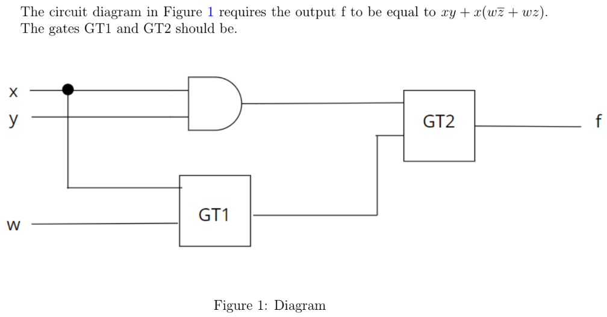
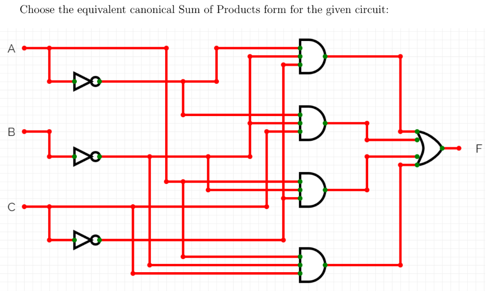

# Week 2 — Graded Assignment 2

> **Score: 90 / 100** | Submitted: Sun, 28 Jun 2026

---

### Q1 — Minimum Gates to Implement AC + ABC

**What is the minimum number of gate(s) required to implement the following Boolean expression after simplification?**

$$
AC + ABC
$$

- **(✓) 1**
- ( ) 2
- ( ) 3
- ( ) 5

#### ✏️ Step-by-Step Solution

**Step 1 — Simplify the expression.**

Using the **Absorption law**: $X + XY = X$

$$
AC + ABC = AC(1 + B) = AC \cdot 1 = AC
$$

**Step 2 — Count the gates.**

The simplified expression $AC$ is just an **AND** of two variables, requiring **1 AND gate**.

$$
\boxed{1 \text{ gate}}
$$

---

### Q2 — NAND Gate with Inputs $\bar{A}$ and $\bar{B}$

**If $\bar{A}$ and $\bar{B}$ are the inputs to a NAND gate, the equivalent output expression would be:**

- ( ) $f = \overline{A} \cdot \overline{B}$
- ( ) $f = \overline{A} + \overline{B}$
- ( ) $f = \overline{(\overline{A} + \overline{B})}$
- **(✓) $f = A + B$**

#### ✏️ Step-by-Step Solution

**Step 1 — Apply the NAND definition.**

$$
\text{NAND}(\overline{A}, \overline{B}) = \overline{\overline{A} \cdot \overline{B}}
$$

**Step 2 — Apply De Morgan's theorem.**

$$
\overline{\overline{A} \cdot \overline{B}} = \overline{\overline{A}} + \overline{\overline{B}} = A + B
$$

So the NAND gate with inverted inputs $\overline{A}$ and $\overline{B}$ is equivalent to an **OR gate** with inputs $A$ and $B$.

$$
\boxed{f = A + B}
$$

---

### Q3 — Self-Dual Boolean Expression

**Which of the following Boolean expressions is equivalent to the dual of that expression?**

- **(✓) $F(x, y, z) = xy + yz + xz$**
- ( ) $F(x, y, z) = xyz + yz + xz$
- ( ) $F(x, y) = \overline{x}y + x\overline{y}$
- ( ) None of the above

#### ✏️ Step-by-Step Solution

**Step 1 — Recall the dual of a Boolean expression.**

The dual of a Boolean expression is obtained by:
- Replacing every AND ($\cdot$) with OR ($+$)
- Replacing every OR ($+$) with AND ($\cdot$)
- Replacing every 0 with 1 and 1 with 0 (if present)
- Leaving variables unchanged

A **self-dual** function satisfies: $F^D(x, y, z) = F(x, y, z)$.

**Step 2 — Compute the dual of $F(x, y, z) = xy + yz + xz$.**

$$
F^D(x, y, z) = (x + y)(y + z)(x + z)
$$

**Step 3 — Expand and simplify.**

$$
(x+y)(y+z)(x+z) = (xy + xz + y^2 + yz)(x+z)
$$

Since $y^2 = y$:

$$
= (xy + xz + y + yz)(x+z)
$$

$$
= y(1 + x + z) + xz(1 + y) = xy + yz + xz \checkmark
$$

This is the **majority function** (returns 1 when at least 2 of 3 inputs are 1), which is self-dual.

$$
\boxed{F(x, y, z) = xy + yz + xz \text{ is self-dual}}
$$

---

### Q4 — Equivalent Boolean Expression

**Which of the following Boolean expression is equivalent to the given Boolean expression?**

$$
Y = \overline{(x+y)(x+\overline{z})(\overline{x}+\overline{y}+z)}
$$

- ( ) $\overline{xy} + \overline{x}z + xy\overline{z}$
- ( ) $\overline{xy} + \overline{x}z + x\overline{y}z$
- ( ) $\overline{xy} + \overline{x}y + xy\overline{z}$
- **(✓) $\overline{x}\overline{y} + \overline{x}z + xy\overline{z}$**
- ( ) None of the above

#### ✏️ Step-by-Step Solution

**Step 1 — Apply De Morgan's Laws to the expression.**

Recall that $\overline{A \cdot B \cdot C} = \overline{A} + \overline{B} + \overline{C}$. Let:
- $A = x + y \implies \overline{A} = \overline{x}\overline{y}$
- $B = x + \overline{z} \implies \overline{B} = \overline{x}z$
- $C = \overline{x} + \overline{y} + z \implies \overline{C} = xy\overline{z}$

**Step 2 — Combine the terms.**

$$
Y = \overline{A} + \overline{B} + \overline{C} = \overline{x}\overline{y} + \overline{x}z + xy\overline{z}
$$

$$
\boxed{Y = \overline{x}\overline{y} + \overline{x}z + xy\overline{z}}
$$

---

### Q5 — Karnaugh Map

**Choose the correct truth table according to the given boolean algebra expression $F(x, y, z) = xyz + \overline{x}y + xy\overline{z}$:**

*Options:*

- ( ) **Option A**
  | x | y | z | F |
  |:-:|:-:|:-:|:-:|
  | 0 | 0 | 0 | 0 |
  | 0 | 0 | 1 | 0 |
  | 0 | 1 | 0 | 0 |
  | 0 | 1 | 1 | 0 |
  | 1 | 0 | 0 | 1 |
  | 1 | 0 | 1 | 0 |
  | 1 | 1 | 0 | 1 |
  | 1 | 1 | 1 | 1 |

- ( ) **Option B**
  | x | y | z | F |
  |:-:|:-:|:-:|:-:|
  | 0 | 0 | 0 | 0 |
  | 0 | 0 | 1 | 0 |
  | 0 | 1 | 0 | 0 |
  | 0 | 1 | 1 | 1 |
  | 1 | 0 | 0 | 0 |
  | 1 | 0 | 1 | 0 |
  | 1 | 1 | 0 | 1 |
  | 1 | 1 | 1 | 1 |

- ( ) **Option C**
  | x | y | z | F |
  |:-:|:-:|:-:|:-:|
  | 0 | 0 | 0 | 0 |
  | 0 | 0 | 1 | 1 |
  | 0 | 1 | 0 | 1 |
  | 0 | 1 | 1 | 1 |
  | 1 | 0 | 0 | 0 |
  | 1 | 0 | 1 | 0 |
  | 1 | 1 | 0 | 1 |
  | 1 | 1 | 1 | 1 |

- **(✓) Option D**
  | x | y | z | F |
  |:-:|:-:|:-:|:-:|
  | 0 | 0 | 0 | 0 |
  | 0 | 0 | 1 | 0 |
  | 0 | 1 | 0 | 1 |
  | 0 | 1 | 1 | 1 |
  | 1 | 0 | 0 | 0 |
  | 1 | 0 | 1 | 0 |
  | 1 | 1 | 0 | 1 |
  | 1 | 1 | 1 | 1 |

#### ✏️ Step-by-Step Solution

**Step 1 — Simplify the expression $F(x, y, z)$.**

$$
F(x, y, z) = xyz + \overline{x}y + xy\overline{z}
$$

Group the first and third terms:

$$
F = xy(z + \overline{z}) + \overline{x}y
$$

Since $z + \overline{z} = 1$:

$$
F = xy + \overline{x}y = y(x + \overline{x}) = y \cdot 1 = y
$$

**Step 2 — Create the truth table.**

Since $F = y$, $F$ must be 1 whenever $y = 1$, and 0 whenever $y = 0$. This corresponds to the table in **Option D**.

$$
\boxed{F = y}
$$

---

### Q6 — Identify Gate Types in Circuit (Image-Based)

**The two gates in the circuit below are:**

- ( ) OR, OR
- **(✓) AND, OR**
- ( ) AND, AND
- ( ) OR, AND

#### ✏️ Step-by-Step Solution

Inspecting the circuit diagram: the first level uses an **AND gate** (outputs 1 only when all inputs are 1), and the second level uses an **OR gate** (outputs 1 when at least one input is 1). This is the standard two-level Sum-of-Products (SOP) structure.

$$
\boxed{\text{AND, OR}}
$$

---

### Q7 — Canonical SOP from Truth Table

**What is the equivalent canonical SOP expression for the truth table given below?**

| A | B | C | F |
|:-:|:-:|:-:|:-:|
| 0 | 0 | 0 | 0 |
| 0 | 0 | 1 | 1 |
| 0 | 1 | 0 | 0 |
| 0 | 1 | 1 | 1 |
| 1 | 0 | 0 | 0 |
| 1 | 0 | 1 | 1 |
| 1 | 1 | 0 | 0 |
| 1 | 1 | 1 | 1 |

- **(✓) Option A** — $\overline{A}.\overline{B}.C + \overline{A}.B.C + A.\overline{B}.C + A.B.C$
- ( ) **Option B** — $\overline{A}.\overline{B}.\overline{C} + \overline{A}.B.C + \overline{A}.\overline{B}.C + A.\overline{B}.C$
- ( ) **Option C** — $\overline{A}.\overline{B}.C + \overline{A}.B.C + A.\overline{B}.\overline{C} + A.B.C$
- ( ) **Option D** — $A.B.\overline{C} + \overline{A}.B.C + A.\overline{B}.C + A.B.C$

#### ✏️ Step-by-Step Solution

**Step 1 — Identify the rows where $F = 1$.**

- Row 2: $A=0, B=0, C=1 \implies \text{minterm} = \overline{A}.\overline{B}.C$
- Row 4: $A=0, B=1, C=1 \implies \text{minterm} = \overline{A}.B.C$
- Row 6: $A=1, B=0, C=1 \implies \text{minterm} = A.\overline{B}.C$
- Row 8: $A=1, B=1, C=1 \implies \text{minterm} = A.B.C$

**Step 2 — Sum the minterms.**

The canonical SOP expression is the sum of these terms:

$$
F = \overline{A}.\overline{B}.C + \overline{A}.B.C + A.\overline{B}.C + A.B.C
$$

This matches **Option A**.

---

### Q8 — SOP Expression for Circuit

**Choose the equivalent canonical Sum of Products form for the given circuit:**

- ( ) $\overline{A}.\overline{B}.\overline{C} + \overline{A}.B.\overline{C} + \overline{A}.\overline{B}.C + A.B.\overline{C}$
- **(✓) $\overline{A}.\overline{B}.\overline{C} + \overline{A}.\overline{B}.C + A.\overline{B}.\overline{C} + A.\overline{B}.C$**
- ( ) $A.\overline{B}.\overline{C} + A.B.C + A.\overline{B}.C + \overline{A}.B.\overline{C}$
- ( ) $A.B.C + \overline{A}.B.C + A.\overline{B}.C + A.B.\overline{C}$

#### ✏️ Step-by-Step Solution

**Step 1 — Trace the circuit outputs.**

The output simplifies to $\overline{B}$.

**Step 2 — Express $\overline{B}$ in canonical 3-variable SOP form.**

$$
\overline{B} = \overline{B}(\overline{A} + A)(\overline{C} + C)
$$

$$
= \overline{B}(\overline{A}\,\overline{C} + \overline{A}C + A\overline{C} + AC)
$$

$$
= \overline{A}\,\overline{B}\,\overline{C} + \overline{A}\,\overline{B}C + A\overline{B}\,\overline{C} + A\overline{B}C
$$

This is exactly the expression in **Option B** (using dot notation).

---

### Q9 — Minimized Boolean Expression

**Which of the following is the minimized form of the boolean expression $(A+\overline{B}+\overline{C})(A+\overline{B}+C)(A+B+\overline{C})$?**

- **(✓) $A + \overline{B}.\overline{C}$**
- ( ) $\overline{A} + \overline{B}.\overline{C}.D$
- ( ) $A.\overline{B} + C.\overline{A}$
- ( ) $A + B.\overline{C}$

#### ✏️ Step-by-Step Solution

**Step 1 — Simplify the first two product terms.**

Let $X = A + \overline{B}$. The first two terms become:

$$
(X + \overline{C})(X + C)
$$

By Distributive law/identity: $(X + Y)(X + \overline{Y}) = X$.

$$
(X + \overline{C})(X + C) = X = A + \overline{B}
$$

**Step 2 — Multiply by the third term.**

Now we multiply by the third term $(A + B + \overline{C})$:

$$
(A + \overline{B})(A + B + \overline{C})
$$

Using the Distributive law $A + YZ = (A+Y)(A+Z)$:

$$
A + \overline{B}(B + \overline{C})
$$

$$
= A + \overline{B}B + \overline{B}\,\overline{C}
$$

Since $\overline{B}B = 0$:

$$
= A + 0 + \overline{B}\,\overline{C} = A + \overline{B}.\overline{C}
$$

$$
\boxed{A + \overline{B}.\overline{C}}
$$

---

### Q10 — SOP Expression for Minterms Σm(1, 3, 5, 7)

**From the given options identify the equivalent SOP expression for a Boolean function with variables A, B and C, where minterms are: Σm(1, 3, 5, 7)**

- ( ) $A.\overline{B}.\overline{C} + \overline{A}.B.C + A.\overline{B}.C + A.B.\overline{C}$
- ( ) $\overline{A}.\overline{B}.C + \overline{A}.B.C + A.\overline{B}.C + A.B.\overline{C}$
- ( ) $\overline{A}.\overline{B}.C + \overline{A}.B.C + \overline{A}.B.\overline{C} + A.B.\overline{C}$
- ( ) $\overline{A}.\overline{B}.C + \overline{A}.B.C + A.\overline{B}.\overline{C} + A.B.\overline{C}$
- **(✓) $\overline{A}.\overline{B}.C + \overline{A}.B.C + A.\overline{B}.C + A.B.C$**

#### ✏️ Step-by-Step Solution

**Step 1 — List the minterms.**

Minterms 1, 3, 5, 7 in a 3-variable (A, B, C) system:

| Minterm | Binary (A, B, C) | SOP Term |
|:---:|:---:|:---:|
| 1 | 001 | $\overline{A}.\overline{B}.C$ |
| 3 | 011 | $\overline{A}.B.C$ |
| 5 | 101 | $A.\overline{B}.C$ |
| 7 | 111 | $A.B.C$ |

**Step 2 — Observe the pattern.**

The sum of these minterms is:

$$
F = \overline{A}.\overline{B}.C + \overline{A}.B.C + A.\overline{B}.C + A.B.C
$$

$$
= C(\overline{A}\,\overline{B} + \overline{A}B + A\overline{B} + AB) = C(1) = C
$$

This matches the expression in **Option 5** (last option).

$$
\boxed{F = C}
$$
