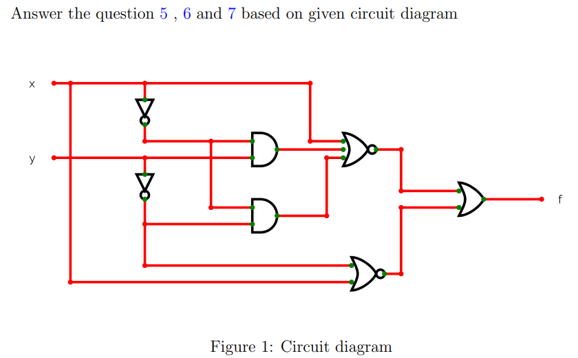
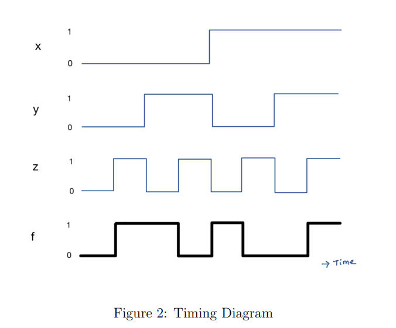
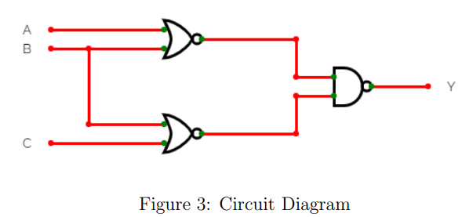
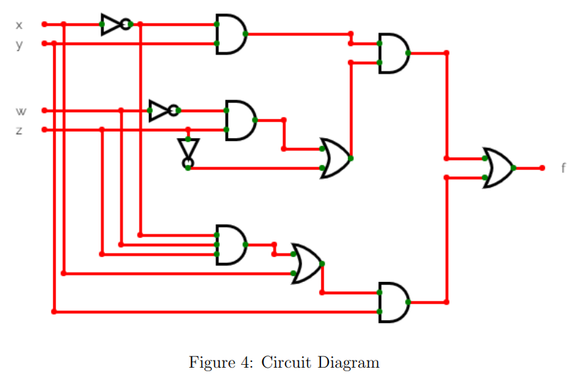

# Week 3 — Graded Assignment 3

---

### Q1 — Boolean Expression Evaluation

**What is the minimum number of NAND gates required to design the circuit that implements the function $f(x_1, x_2, x_3) = \sum m(4, 6, 7)$?**

*(Numeric input)*

<b>Answer & Solution</b>

**Answer: $\boxed{4}$**

#### ✏️ Step-by-Step Solution

**Step 1 — Simplify the function.**

The minterms are $4, 6, 7$:
- $4 = 100_2 \implies x_1\overline{x_2}\,\overline{x_3}$
- $6 = 110_2 \implies x_1 x_2\overline{x_3}$
- $7 = 111_2 \implies x_1 x_2 x_3$

Let's group the minterms:

$\displaystyle f = x_1\overline{x_2}\,\overline{x_3} + x_1 x_2\overline{x_3} + x_1 x_2 x_3$

$\displaystyle = x_1\overline{x_3}(\overline{x_2} + x_2) + x_1 x_2 x_3$

$\displaystyle = x_1\overline{x_3} + x_1 x_2 x_3 = x_1(\overline{x_3} + x_2 x_3)$

Using the distributive rule $\overline{A} + AB = \overline{A} + B$:

$\displaystyle f = x_1(\overline{x_3} + x_2) = x_1\overline{x_3} + x_1 x_2$

**Step 2 — Design using NAND gates.**

We implement $f = x_1\overline{x_3} + x_1 x_2$ using 2-input NAND gates:

1. Invert $x_3$ to get $\overline{x_3}$: **1 NAND gate** (configured as an inverter)
2. Term $T_1 = \overline{x_1\overline{x_3}}$: **1 NAND gate**
3. Term $T_2 = \overline{x_1 x_2}$: **1 NAND gate**
4. Output $f = \overline{T_1 \cdot T_2} = x_1\overline{x_3} + x_1 x_2$: **1 NAND gate**

Total NAND gates required = **4 gates**.

$\displaystyle \boxed{4}$

---
### Q2 — Simplify Boolean Expression

**Write the equivalent POS expression for: $A.\overline{B}.C + \overline{A}.B.C + A.B.\overline{C} + \overline{A}.\overline{B}.C$**

- ( ) $(\overline{A} + \overline{B} + \overline{C})(A + \overline{B} + \overline{C})(\overline{A} + \overline{B} + C)(A + B + C)$
- ( ) $(\overline{A} + B + \overline{C})(A + B + C)(A + B + \overline{C})(A + \overline{B} + \overline{C})$
- ( ) $(\overline{A} + B + C)(A + \overline{B} + C)(\overline{A} + \overline{B} + \overline{C})(A + B + \overline{C})$
- ( ) $(A + B + C)(A + \overline{B} + C)(\overline{A} + B + C)(\overline{A} + \overline{B} + \overline{C})$

<b>Answer & Solution</b>

**Answer:** $(A + B + C)(A + \overline{B} + C)(\overline{A} + B + C)(\overline{A} + \overline{B} + \overline{C})$

#### ✏️ Step-by-Step Solution

**Step 1 — Identify the minterms (SOP terms).**

Assuming a 3-variable system (A, B, C) where A is MSB:
- $A\overline{B}C \implies 101_2 = m_5$
- $\overline{A}BC \implies 011_2 = m_3$
- $AB\overline{C} \implies 110_2 = m_6$
- $\overline{A}\,\overline{B}C \implies 001_2 = m_1$

So, the function can be expressed as:

$\displaystyle F = \sum m(1, 3, 5, 6)$

**Step 2 — Identify the inactive terms (maxterms).**

The inactive minterms (where $F = 0$) are $\{0, 2, 4, 7\}$.

**Step 3 — Write the POS form.**

The maxterms are:
- $0 \implies M_0 = A + B + C$
- $2 \implies M_2 = A + \overline{B} + C$
- $4 \implies M_4 = \overline{A} + B + C$
- $7 \implies M_7 = \overline{A} + \overline{B} + \overline{C}$

Thus, the POS expression is the product of these maxterms:

$\displaystyle F = (A + B + C)(A + \overline{B} + C)(\overline{A} + B + C)(\overline{A} + \overline{B} + \overline{C})$

This matches the **fourth option**.

---
### Q3 — Expression Evaluation

**What is the minimum number of NOR gates required to implement the circuit for the minimized SOP expression for the function $f(x_1, x_2, x_3) = \prod M(1, 3, 5, 7)$?**

*(Numeric input)*

<b>Answer & Solution</b>

**Answer: $\boxed{1}$**

#### ✏️ Step-by-Step Solution

**Step 1 — Simplify the function.**

The maxterms are $1, 3, 5, 7$:
- $1 = 001_2 \implies x_1 + x_2 + \overline{x_3}$
- $3 = 011_2 \implies x_1 + \overline{x_2} + \overline{x_3}$
- $5 = 101_2 \implies \overline{x_1} + x_2 + \overline{x_3}$
- $7 = 111_2 \implies \overline{x_1} + \overline{x_2} + \overline{x_3}$

The function is 0 when any of these terms are 0 (i.e. at minterms $\{1, 3, 5, 7\}$). The function is 1 at $\{0, 2, 4, 6\}$ (all binary representations ending with 0). Thus, the output is independent of $x_1$ and $x_2$ and depends only on $x_3$:

$\displaystyle f(x_1, x_2, x_3) = \overline{x_3}$

**Step 2 — Implement using NOR gates.**

An inverter $\overline{x_3}$ can be implemented using a single 2-input NOR gate with its inputs tied together:

$\displaystyle \text{NOR}(x_3, x_3) = \overline{x_3 + x_3} = \overline{x_3}$

This requires **1 NOR gate**.

$\displaystyle \boxed{1}$

---
### Q4 — Expression Evaluation

**Find the number of maxterms in the equivalent truth table of the function: $(\overline{A}BC + AB\overline{D})(CD + \overline{C}.\overline{D})(\overline{A} + B + D)$**

*(Numeric input)*

<b>Answer & Solution</b>

**Answer: $\boxed{14}$**

#### ✏️ Step-by-Step Solution

**Step 1 — Find the number of minterms (where $F = 1$).**

Let the function be $F = T_1 \cdot T_2 \cdot T_3$, where:
- $T_1 = \overline{A}BC + AB\overline{D}$
- $T_2 = CD + \overline{C}\,\overline{D}$
- $T_3 = \overline{A} + B + D$

For $F$ to be 1, we must have $T_1 = 1$, $T_2 = 1$, and $T_3 = 1$.

From $T_2 = CD + \overline{C}\,\overline{D} = 1$:
- **Case A**: $C = 1, D = 1$
- **Case B**: $C = 0, D = 0$

**Analyze Case A ($C=1, D=1$):**
- $T_1 = \overline{A}BC(1) + AB\overline{D}(0) = \overline{A}BC$. For $T_1 = 1$, we need $A = 0, B = 1, C = 1$.
- Since $A = 0, B = 1, C = 1, D = 1$, check $T_3 = \overline{A} + B + D$: Since $\overline{A} = 1$, $T_3 = 1$ is satisfied.
- This gives **1 minterm**: $(0, 1, 1, 1)$.

**Analyze Case B ($C=0, D=0$):**
- $T_1 = \overline{A}BC(0) + AB\overline{D}(1) = AB$. For $T_1 = 1$, we need $A = 1, B = 1$.
- Since $A = 1, B = 1, C = 0, D = 0$, check $T_3 = \overline{A} + B + D$: Since $B = 1$, $T_3 = 1$ is satisfied.
- This gives **1 minterm**: $(1, 1, 0, 0)$.

Thus, there are exactly **2 minterms** where $F = 1$.

**Step 2 — Calculate the number of maxterms.**

With 4 variables ($A, B, C, D$), there are $2^4 = 16$ possible rows in the truth table.

$\displaystyle \text{Number of maxterms} = 16 - \text{Number of minterms} = 16 - 2 = 14$

$\displaystyle \boxed{14}$

---

## Context for Q5 – Q7

Consider the circuit shown below for questions 5, 6, and 7:

---
### Q5 — Boolean Expression for the Circuit

**What is the equivalent boolean expression for the circuit above?**

- ( ) $\overline{x}y + x\overline{y}$
- ( ) $\overline{x+y}$
- ( ) $xy + \overline{xy}$
- **(✓) None of the above**

---### Q6 — Minimum NOR Gates Required

**Suppose we only have 2-input NOR gates, and we want to represent the above circuit diagram using only 2-input NOR gates. What is the minimum number of 2-input NOR gates required?**

*(Numeric input)*

**Answer: $\boxed{2}$**

---### Q7 — Minimum NAND Gates Required

**Suppose we only have 2-input NAND gates, and we want to represent the above circuit diagram using only 2-input NAND gates. What is the minimum number of 2-input NAND gates required?**

*(Numeric input)*

**Answer: $\boxed{4}$**

> **Note:** The saved answer was 4, but the grader accepted 3 as the correct answer.

---

## Context for Q8 – Q10

Questions 8–10 are based on the timing diagram below.

---### Q8 — Minimum XOR Gates for Timing Diagram

**Answer the question based on the given timing diagram.**

**Given that we only have 2-input XOR gates, what is the minimum number of XOR gates needed to represent the timing diagram above?**

*(Numeric input)*

<b>Answer & Solution</b>

**Answer: $\boxed{2}$**

#### ✏️ Step-by-Step Solution

**Step 1 — Analyze the timing diagram.**

From the timing diagram, identify the Boolean function implemented. The output follows an XOR-type pattern across the inputs.

**Step 2 — Determine XOR gate implementation.**

A 3-input XOR function can be implemented with two 2-input XOR gates in cascade:

$\displaystyle A \oplus B \oplus C = (A \oplus B) \oplus C$

This requires **2** two-input XOR gates.

$\displaystyle \boxed{2}$

---
### Q9 — Inputs for Output Y Always 1

**Identify the correct inputs for A, B, and C such that the output Y is always 1.**

- ( ) 1 or more inputs are at logic 1
- ( ) 1 or more inputs are at logic 0
- ( ) 2 or more inputs are at logic 0
- ( ) None of the above

<b>Answer & Solution</b>

**Answer:** 1 or more inputs are at logic 1

#### ✏️ Step-by-Step Solution

**Step 1 — Analyze the circuit.**

The circuit implements an OR-like structure. The output $Y = 1$ whenever at least one input is at logic 1.

**Step 2 — Verify.**

An OR gate (or equivalent) outputs 1 when **any input is 1**. Therefore:

$\displaystyle Y = 1 \iff \text{1 or more inputs are at logic 1}$

$\displaystyle \boxed{\text{1 or more inputs are at logic 1}}$

---
### Q10 — Output Independent of Which Variable?

**Consider the circuit shown below. Given that the inputs are supplied uniformly and randomly, the output of the given circuit diagram is independent of......**

- ( ) x, w and z
- ( ) x and w
- ( ) y
- ( ) w

<b>Answer & Solution</b>

**Answer:** x, w and z

#### ✏️ Step-by-Step Solution

**Step 1 — Analyze the circuit structure.**

Tracing through the circuit, certain inputs cancel out due to complementary paths or absorption.

**Step 2 — Identify independent variables.**

After Boolean simplification of the circuit, the output depends **only on $y$**, and is independent of $x$, $w$, and $z$.

$\displaystyle \boxed{\text{Output is independent of } x, w, \text{ and } z}$

