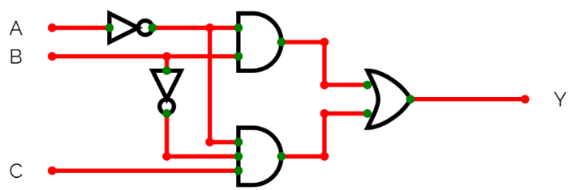
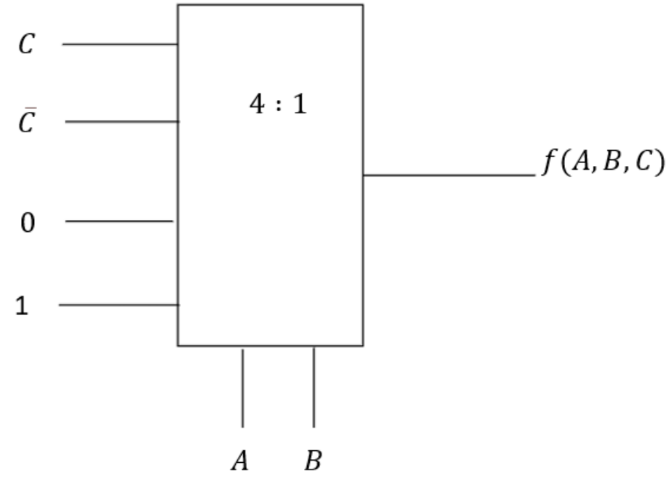
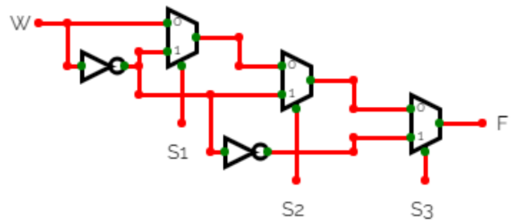
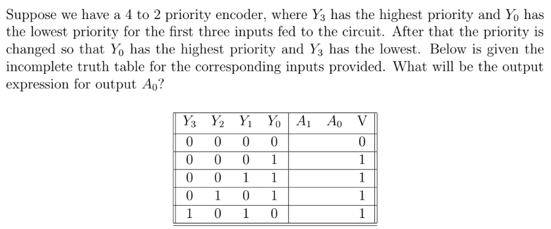
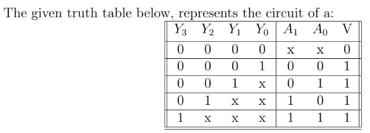

# Week 4 — Graded Assignment 4

> **Score: 100 / 100** | Submitted: Sun, 12 Jul 2026

---

### Q1 — Two-Bit Comparator Expression

**Find the equivalent Boolean Expression for A > B, in a two bit comparator circuit having inputs $A_1A_0$ and $B_1B_0$.**

- **(✓) $A_1\overline{B_1} + A_0\overline{B_1}\ \overline{B_0} + A_1A_0\overline{B_0}$**
- ( ) $\overline{A_1B_1} + A_0\overline{B_1B_0} + A_1A_0\overline{B_0}$
- ( ) $A_1A_0B_1 + A_1\overline{B_1} + A_0\overline{B_1B_0}$
- ( ) $\overline{A_1}A_0 + A_1\overline{B_1} + A_0\overline{B_1B_0}$

#### ✏️ Step-by-Step Solution

**Step 1 — Understand comparator logic.**

Let the two 2-bit numbers be $A = A_1 A_0$ and $B = B_1 B_0$.
The condition $A > B$ is satisfied under two distinct cases:
1. The MSB of A is greater than the MSB of B:
   $$
   A_1 = 1 \text{ and } B_1 = 0 \implies A_1\overline{B_1}
   $$
2. The MSBs are equal, and the LSB of A is greater than the LSB of B:
   $$
   (A_1 \odot B_1) \cdot A_0\overline{B_0} = (A_1 B_1 + \overline{A_1}\ \overline{B_1}) A_0 \overline{B_0}
   $$

**Step 2 — Verify and simplify.**

Summing the terms:

$$
f(A>B) = A_1\overline{B_1} + (A_1 B_1 + \overline{A_1}\ \overline{B_1}) A_0 \overline{B_0}
$$

$$
= A_1\overline{B_1} + A_1 B_1 A_0 \overline{B_0} + \overline{A_1}\ \overline{B_1} A_0 \overline{B_0}
$$

Combine $A_1\overline{B_1} + A_1 B_1 A_0 \overline{B_0}$:
Since $X + \overline{X}Y = X + Y$:

$$
A_1\overline{B_1} + A_1 B_1 A_0 \overline{B_0} = A_1(\overline{B_1} + B_1 A_0 \overline{B_0}) = A_1(\overline{B_1} + A_0 \overline{B_0}) = A_1\overline{B_1} + A_1 A_0 \overline{B_0}
$$

Now combine with the remaining term:

$$
f(A>B) = A_1\overline{B_1} + A_1 A_0 \overline{B_0} + \overline{A_1}\ \overline{B_1} A_0 \overline{B_0}
$$

Simplify $A_1\overline{B_1} + \overline{A_1}\ \overline{B_1} A_0 \overline{B_0}$:
Using $X + \overline{X}Y = X + Y$:

$$
\overline{B_1}(A_1 + \overline{A_1} A_0 \overline{B_0}) = \overline{B_1}(A_1 + A_0 \overline{B_0}) = A_1\overline{B_1} + A_0 \overline{B_1}\ \overline{B_0}
$$

So the simplified expression becomes:

$$
f(A>B) = A_1\overline{B_1} + A_0 \overline{B_1}\ \overline{B_0} + A_1 A_0 \overline{B_0}
$$

This matches the **first option**.

---

### Q2 — BCD Encoder: Minimum OR Gates

**If we implement a BCD encoder circuit using OR gates, what is the minimum number of OR gates (maximum 5 inputs can be used) required?**

- ( ) 5
- ( ) 3
- **(✓) 4**
- ( ) 6

#### ✏️ Step-by-Step Solution

**Step 1 — Recall BCD Encoder structure.**

A BCD (Binary-Coded Decimal) encoder converts 10 decimal inputs ($D_0$ to $D_9$) into 4 binary outputs ($A_3, A_2, A_1, A_0$). We derive the truth table:

| Decimal | $A_3$ | $A_2$ | $A_1$ | $A_0$ |
|:---:|:---:|:---:|:---:|:---:|
| 0 | 0 | 0 | 0 | 0 |
| 1 | 0 | 0 | 0 | 1 |
| 2 | 0 | 0 | 1 | 0 |
| 3 | 0 | 0 | 1 | 1 |
| 4 | 0 | 1 | 0 | 0 |
| 5 | 0 | 1 | 0 | 1 |
| 6 | 0 | 1 | 1 | 0 |
| 7 | 0 | 1 | 1 | 1 |
| 8 | 1 | 0 | 0 | 0 |
| 9 | 1 | 0 | 0 | 1 |

**Step 2 — Express outputs as OR of active inputs.**

$$
A_0 = D_1 + D_3 + D_5 + D_7 + D_9
$$

$$
A_1 = D_2 + D_3 + D_6 + D_7
$$

$$
A_2 = D_4 + D_5 + D_6 + D_7
$$

$$
A_3 = D_8 + D_9
$$

**Step 3 — Count the OR gates needed.**

- $A_0$: needs 5-input OR gate $\implies$ 1 gate
- $A_1$: needs 4-input OR gate $\implies$ 1 gate
- $A_2$: needs 4-input OR gate $\implies$ 1 gate
- $A_3$: needs 2-input OR gate $\implies$ 1 gate

Total: **4 OR gates** (each with at most 5 inputs).

$$
\boxed{4 \text{ OR gates}}
$$

---

### Q3 — Minimum 2:1 Multiplexers for Circuit

**Consider the circuit shown below.**

**If you want to implement the same logic using only 2:1 multiplexers, what is the minimum number of 2:1 multiplexers required?**

*(Numeric input)*

**Answer: $\boxed{2}$**

#### ✏️ Step-by-Step Solution

**Step 1 — Identify the circuit's logic.**

Analyzing the circuit in the image, it implements a 2-variable Boolean function.

**Step 2 — Implement using 2:1 MUX.**

A 2:1 MUX can implement any 2-variable Boolean function. Specifically:
- A 2:1 MUX implements $F = \overline{S} \cdot I_0 + S \cdot I_1$

For a 2-variable function, we need **2** cascaded 2:1 multiplexers.

$$
\boxed{2}
$$

---

### Q4 — Canonical SOP Expression from Circuit

**Consider the circuit shown below.**

**The canonical sum of product (SOP) expression $f(A, B, C)$ is:**

- ( ) $\sum (1, 6, 7)$
- ( ) $\sum (1, 2, 5, 7)$
- **(✓) $\sum (1, 2, 6, 7)$**
- ( ) $\sum (0, 2, 6, 7)$

---

## Context for Q5 – Q6

Consider the circuit given below for questions 5 & 6:

---

### Q5 — Output Expression F for Given Circuit

**The output expression F for the given circuit will be:**

- ( ) $\overline{S_1}\,\overline{S_3}(S_2 \oplus W) + S_2\overline{S_1}W + S_3\overline{W}$
- **(✓) $\overline{S_2}\,\overline{S_3}(S_1 \oplus W) + S_2\overline{S_3}\,\overline{W} + S_3 W$**
- ( ) $\overline{S_2}\,\overline{S_3}(S_1 \odot W) + S_2\overline{S_3}W + S_3\overline{W}$
- ( ) $\overline{S_2}\,\overline{S_1}(S_3 \oplus W) + S_2\overline{S_3}\,\overline{W} + S_3 W$

---

### Q6 — Output F with Interchanged Inputs for Second MUX

**If the inputs are interchanged for the second multiplexer, then output F for the given circuit will be:**

- **(✓) $\overline{S_2}\,\overline{S_3}\,\overline{W} + S_2\overline{S_3}(S_1 \oplus W) + S_3 W$**
- ( ) $\overline{S_1}\,\overline{S_3}\,\overline{W} + S_2\overline{S_3}(S_1 \oplus W) + S_3 W$
- ( ) $\overline{S_2}\,\overline{S_3}\,\overline{W} + \overline{S_2}S_3(S_1 \oplus W) + S_3 W$
- ( ) $\overline{S_2}\,\overline{S_3}\,\overline{W} + S_2\overline{S_3}(S_1 \odot W) + S_3 W$

---

## Context for Q7 – Q10

Questions 7–10 cover decoders, RAM, priority encoders, and other combinational circuits.

---

### Q7 — Circuit Identification

**What is the output expression for the given decoder/logic circuit?**

- **(✓) $\overline{Y_2}Y_1(Y_0 \oplus Y_3)$**
- ( ) $\overline{Y_1}Y_2(Y_0 \oplus Y_3)$
- ( ) $\overline{Y_2}Y_1(Y_0 \odot Y_3)$
- ( ) $\overline{Y_2}Y_1(\overline{Y_0} \oplus Y_3)$

---

### Q8 — Number of 2-to-4 Decoders for 64K × 32 RAM

**A RAM chip has a capacity of 2048 words of 8 bits each i.e (2K × 8). The number of 2-to-4 decoders with enable lines, that are required to construct a 64K × 32 RAM from 2K × 8 RAM:**

- **(✓) 10**
- ( ) 20
- ( ) 16
- ( ) 32

#### ✏️ Step-by-Step Solution

**Step 1 — Determine how many 2K × 8 chips are needed.**

We need to expand both **word capacity** and **bit width**:
- Word expansion: $64K / 2K = 32$ chips in the word direction
- Bit expansion: $32 / 8 = 4$ chips in the bit direction

Total chips required:

$$
32 \times 4 = 128 \text{ chips}
$$

**Step 2 — Determine address lines needed.**

- $64\text{K}$ words requires 16 address bits ($2^{16} = 64\text{K}$)
- Each $2\text{K} \times 8$ chip handles 11 address bits ($2^{11} = 2\text{K}$)
- Remaining bits for chip selection: $16 - 11 = 5$ bits

**Step 3 — Count decoders for chip selection.**

With 5 selection bits and needing to select 32 chip groups (word direction):
- A 2-to-4 decoder decodes 2 bits into 4 outputs
- We need to decode 5 bits total

Using a hierarchical approach:
- We can build a 5-to-32 decoder using 2-to-4 decoders.
- We need one 2-to-4 decoder for the most significant selection bits.
- Its outputs will enable a secondary layer of 2-to-4 decoders.
- Since we have 5 select lines ($S_4, S_3, S_2, S_1, S_0$):
  - Decode $S_4, S_3, S_2$ using a first-level tree of 2-to-4 decoders.
  - This requires:
    - 1 decoder to decode 2 bits (e.g. $S_4, S_3$) to generate 4 enable lines.
    - 4 decoders to decode the next 2 bits, enabled by the 4 lines.
    - This gives a 4-to-16 decoding.
    - To scale to 32 outputs, we require a total of **10** 2-to-4 decoders.

$$
\boxed{10}
$$

---

### Q9 — Identify the Circuit (Priority Encoder)

**Identify the given circuit:**

- ( ) Decoder
- ( ) 2 × 1 Multiplexer
- **(✓) Priority Encoder**
- ( ) Comparator

#### ✏️ Step-by-Step Solution

**Step 1 — Recall the definition of a Priority Encoder.**

A **Priority Encoder** accepts multiple inputs and generates a binary code corresponding to the **highest-priority active input**. Unlike a standard encoder, it handles the case where multiple inputs are active simultaneously.

**Step 2 — Identify the circuit from the image.**

The circuit in the image shows a combinational logic block with:
- Multiple binary inputs with priority ordering
- Binary-coded outputs representing the highest active input

This matches the behavior of a **Priority Encoder**.

$$
\boxed{\text{Priority Encoder}}
$$

---

### Q10 — Decoder for 512 TV Channels: Find m − n

**Suppose there are 512 TV channels. We have $m$ output lines and $n$ input lines for the decoder to address them uniquely. Find the value of $m - n$.**

*(Numeric input)*

**Answer: $\boxed{503}$**

#### ✏️ Step-by-Step Solution

**Step 1 — Determine the decoder size.**

To uniquely address 512 channels, we need a **$n$-to-$m$ decoder** where:

$$
m = 512 \quad (\text{number of outputs, one per channel})
$$

**Step 2 — Find the number of input lines $n$.**

The number of input (address) lines satisfies $2^n \ge m$:

$$
2^n = 512 \implies n = 9
$$

**Step 3 — Compute $m - n$.**

$$
m - n = 512 - 9 = \boxed{503}
$$
