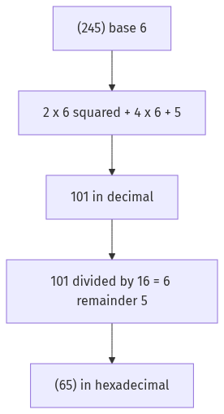
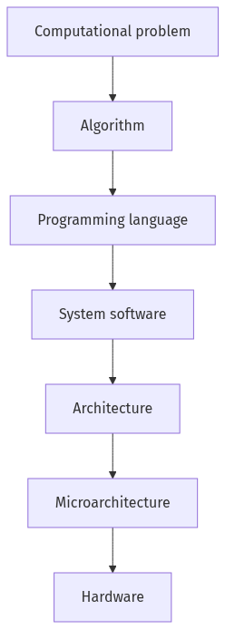
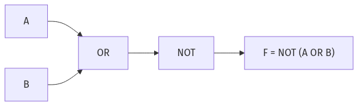
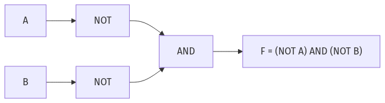
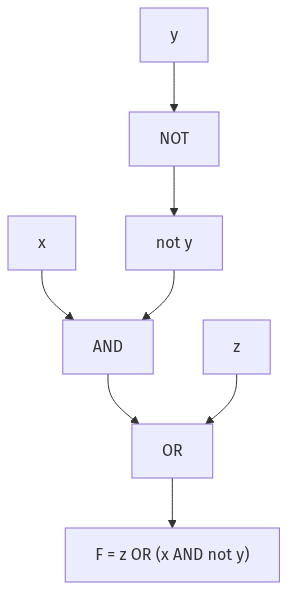
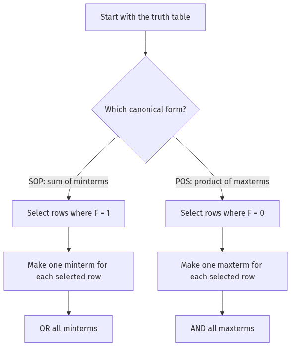

# Week 1–2 Learning Notes — From Level 0

These notes teach the ideas needed for every question in `ga1.md`, `pa1.md`, `ga2.md`, and `pa2.md`. Read this file in order the first time. The companion [quick notes](week1-week2-quick-notes.md) are for revision after the ideas make sense.

> **Best way to learn:** Read Sections 2, 3, 8, 9, and 14 first. They contain the formulas and rules used most often. Then use Section 15 as your question-solving checklist and the [quick notes](week1-week2-quick-notes.md) for revision.

> **Diagrams:** The visual diagrams in this file were generated with Kroki. Their editable Mermaid source files are kept in [`Q1/diagrams`](diagrams/).

## Start here — the 6 rules to remember

| Rule | What it solves |
|---|---|
| $n$ bits make $2^n$ patterns | Character capacity and number of values |
| Largest unsigned $n$-bit value is $2^n-1$ | Largest binary number |
| Convert base $b$ using powers of $b$ | All number-base conversions |
| Every digit must be smaller than its base | Unknown-base questions |
| Move NOT inside, swap AND/OR | De Morgan questions |
| SOP uses 1-rows; POS uses 0-rows | Minterms and maxterms |

## 1. The language used in these notes

A **bit** is one binary digit. It can be either `0` or `1`.

In these notes, a prime means **NOT**. Read $A'$ as “NOT A.” Your assignments sometimes show NOT using a line above a letter; it has exactly the same meaning. Prime notation is used here because it stays clear and reliable on GitHub.

In Boolean algebra:

| Written form | Meaning | Gate |
|---|---|---|
| $A+B$ | $A$ OR $B$ | OR |
| $AB$ or $A\cdot B$ | $A$ AND $B$ | AND |
| $A'$ | NOT $A$ | NOT |
| $A\oplus B$ | exactly one input is 1 | XOR |
| $A\odot B$ | both inputs are equal | XNOR |

The symbols `+` and multiplication do **not** mean ordinary arithmetic here. For example, in Boolean algebra, $1+1=1$.

## 2. Bits and how many values they represent

### 2.1 Number of patterns made by $n$ bits

Every bit has 2 choices. Therefore:

$$
\boxed{\text{number of distinct patterns}=2^n}
$$

Example: 6 bits can represent

$$
2^6=64
$$

different characters or values. These patterns run from `000000` to `111111`.

### 2.2 Largest unsigned value stored in $n$ bits

The largest value has every bit equal to 1:

$$
\boxed{\text{largest unsigned value}=2^n-1}
$$

Examples:

- 10 bits: $2^{10}-1=1023$
- 16 bits: $2^{16}-1=65535$

Do not confuse the two formulas:

- $2^n$ = how many different values exist.
- $2^n-1$ = the largest unsigned value, because counting begins at 0.

### 2.3 Minimum bits needed for a positive integer $N$

Find the smallest $n$ for which $N\le 2^n-1$. Equivalently:

$$
n=\lfloor\log_2N\rfloor+1\qquad(N\ge1)
$$

For powers of 2, remember the extra bit:

$$
32=2^5=(100000)_2
$$

so 32 needs 6 bits, not 5. With 5 bits the largest value is only $2^5-1=31$.

> Special case: representing only the value 0 still needs one bit, `0`.

## 3. Number systems and bases

### 3.1 What a base means

In base $b$, the allowed digits are

$$
0,1,2,\ldots,b-1.
$$

Therefore, the base must be greater than every digit used.

Examples:

- $(421)_5$ is legal because every digit is less than 5.
- $(157)_b$ requires $b>7$, so $b\ge8$.

This digit check is the first step in every unknown-base question.

### 3.2 Positional-value formula

For an integer written in base $b$:

$$
\boxed{(d_nd_{n-1}\ldots d_1d_0)_b=\sum_{i=0}^{n}d_i b^i}
$$

The rightmost digit uses $b^0$, the next uses $b^1$, and so on.

Example:

$$
(11001)_2=1(2^4)+1(2^3)+0(2^2)+0(2^1)+1(2^0)=25.
$$

For digits after a radix point, use negative powers:

$$
(24.2)_b=2b^1+4b^0+2b^{-1}=2b+4+\frac2b.
$$

### 3.3 Convert any base to decimal

Use this routine:

1. Write the powers of the base under the digits.
2. Multiply each digit by its power.
3. Add the results.

Example:

$$
(245)_6=2(6^2)+4(6^1)+5(6^0)=72+24+5=101.
$$

### 3.4 Convert decimal to another base

For the integer part:

1. Divide by the new base.
2. Record the remainder.
3. Divide the quotient again.
4. Stop when the quotient becomes 0.
5. Read the remainders from bottom to top.

Example: convert $63$ to hexadecimal.

$$
63\div16=3\text{ remainder }15.
$$

In hexadecimal, $15=F$, so $63=(3F)_{16}$.

Hexadecimal digits are:

| Decimal | Hex | Decimal | Hex |
|---:|:---:|---:|:---:|
| 10 | A | 13 | D |
| 11 | B | 14 | E |
| 12 | C | 15 | F |

### 3.5 Convert from base $a$ to base $b$

The safe universal path is:

$$
\boxed{\text{base }a\longrightarrow\text{decimal}\longrightarrow\text{base }b}
$$

Example: $(223)_5$ to hexadecimal.

$$
(223)_5=2(25)+2(5)+3=63=(3F)_{16}.
$$

The important idea is the middle step: **decimal is the safe bridge between any two bases**.

### 3.6 Find an unknown base

Replace every base-$b$ number by a polynomial in $b$, then solve the resulting ordinary equation.

Example: if $(421)_5=(157)_b$, first calculate

$$
(421)_5=4(25)+2(5)+1=111.
$$

Then

$$
b^2+5b+7=111,
$$

which gives $b=8$. Finally check that $b>7$ because digit 7 appears.

For two unknown bases and multiple-choice answers, expand both sides:

$$
(3451)_a=3a^3+4a^2+5a+1,
$$

$$
(1417)_b=b^3+4b^2+b+7.
$$

Reject illegal bases first, then test the remaining choices.

### 3.7 Unknown base inside a quadratic equation

For

$$
x^2-(11)_b x+(21)_b=0,
$$

convert the coefficients:

$$
(11)_b=b+1,\qquad(21)_b=2b+1.
$$

If the roots are $r_1,r_2$, Vieta's formulas say:

$$
\boxed{r_1+r_2=\text{coefficient of }x\text{ with sign changed}}
$$

$$
\boxed{r_1r_2=\text{constant term}}
$$

For roots 3 and 5:

$$
b+1=3+5=8\Rightarrow b=7,
$$

and the product confirms it:

$$
2b+1=3\cdot5=15.
$$

### 3.8 Unknown-base division with a fractional answer

Convert all three numbers to base-10 polynomials before doing algebra. For

$$
\frac{(514)_b}{(20)_b}=(24.2)_b,
$$

write

$$
\frac{5b^2+b+4}{2b}=2b+4+\frac2b.
$$

Clear the denominator, solve, reject impossible roots, and check $b$ against the largest digit. This gives $b=7$.

## 4. Moore's law

For these assignments, use the course model: the transistor count doubles every 2 years.

If the initial count is $T_0$ and $y$ years pass:

$$
\boxed{T=T_0\times2^{y/2}}
$$

Example: 2 million transistors after 8 years:

$$
\text{doublings}=8/2=4,
$$

$$
T=2\text{ million}\times2^4=32\text{ million}.
$$

Moore's law is an empirical trend, not a mathematical law of nature. In these questions, however, apply the stated two-year doubling rule directly.

## 5. How computers physically represent a bit

Computer systems commonly encode logic 0 and 1 using **voltage ranges**.

Given a low threshold $V_L$ and a high threshold $V_H$:

$$
V\le V_L\Rightarrow0,
$$

$$
V\ge V_H\Rightarrow1,
$$

$$
V_L<V<V_H\Rightarrow\text{illegal or undefined region}.
$$

Example: if $V_L=3.56$ and $V_H=3.97$, then $3.58$ lies strictly between them, so it is illegal/undefined.

A good physical bit should be:

- small and inexpensive;
- stable and reliable;
- easy and fast to read, write, and manipulate.

## 6. Two different computer-system hierarchies

The assignments use two hierarchies. Keep them separate.

### 6.1 Transformation/abstraction hierarchy

This describes the journey from a human goal down to physical hardware:

$$
\text{Computational problem}\rightarrow\text{algorithm}\rightarrow
\text{programming language}\rightarrow\text{system software}\rightarrow
\text{architecture}\rightarrow\text{microarchitecture}\rightarrow\text{hardware}.
$$

The **computational problem** is the highest abstraction because it says *what* must be solved. Each later level adds more detail about *how* it will be solved.

### 6.2 Structural/physical design hierarchy

A useful simplified view for these questions is:

$$
\text{system}\rightarrow\text{PCB/board}\rightarrow\text{ICs and modules}
\rightarrow\text{cells}\rightarrow\text{gates}\rightarrow\text{circuits/devices}.
$$

Remember the exact assignment relationships:

- PCBs contain ICs.
- Modules are composed of cells.
- Cells are composed of gates.
- Gates are implemented by transistor circuits.

Understanding hardware and software together helps people build better software, better hardware, and better complete systems. That is why “all of the above” is correct in the corresponding practice question.

## 7. Logic gates from zero

### 7.1 Basic truth table

| $A$ | $B$ | AND $AB$ | OR $A+B$ | XOR $A\oplus B$ | XNOR $A\odot B$ |
|:-:|:-:|:-:|:-:|:-:|:-:|
| 0 | 0 | 0 | 0 | 0 | 1 |
| 0 | 1 | 0 | 1 | 1 | 0 |
| 1 | 0 | 0 | 1 | 1 | 0 |
| 1 | 1 | 1 | 1 | 0 | 1 |

NOT simply flips a bit:

$$
0'=1,\qquad1'=0.
$$

NAND and NOR are complemented gates:

$$
\text{NAND}(A,B)=(AB)',
$$

$$
\text{NOR}(A,B)=(A+B)'.
$$

### 7.2 Reading gate diagrams

- AND gate: flat left side, curved right side.
- OR gate: curved input side and pointed output side.
- A small bubble means inversion/NOT.
- AND followed by an output bubble is NAND.
- OR followed by an output bubble is NOR.

## 8. Boolean laws to know

These laws are the main tools for Week 2.

| Name | Law |
|---|---|
| Identity | $X+0=X$, $X\cdot1=X$ |
| Null/dominance | $X+1=1$, $X\cdot0=0$ |
| Idempotent | $X+X=X$, $XX=X$ |
| Complement | $X+X'=1$, $XX'=0$ |
| Double complement | $(X')'=X$ |
| Commutative | $X+Y=Y+X$, $XY=YX$ |
| Associative | $(X+Y)+Z=X+(Y+Z)$, $(XY)Z=X(YZ)$ |
| Distributive | $X(Y+Z)=XY+XZ$ |
| Boolean distributive | $X+YZ=(X+Y)(X+Z)$ |
| Absorption | $X+XY=X$, $X(X+Y)=X$ |
| Useful combining | $X+X'Y=X+Y$ |
| Pair removal | $XY+XY'=X$ |
| POS pair removal | $(X+Y)(X+Y')=X$ |
| Consensus | $XY+X'Z+YZ=XY+X'Z$ |

Two patterns deserve special attention:

$$
AC+ABC=AC(1+B)=AC,
$$

and

$$
xy+x'y=y(x+x')=y.
$$

### Important assignment note about consensus

The identity

$$
xy+yz+x'z=xy+x'z
$$

is mathematically valid: $yz$ is the consensus term and is redundant. `pa2.md` notes that a particular grader did not mark this option, but that grading behavior does not make the identity false. Learn the theorem, while being aware of the saved answer-key inconsistency.

## 9. De Morgan's laws

These two laws are essential:

$$
(X+Y)'=X'\,Y'
$$

$$
(XY)'=X'+Y'
$$

A simple memory rule is: **move NOT inside and change the operator**.

- OR changes to AND.
- AND changes to OR.
- Every variable inside the bracket gets NOT.

The multiplication in $X'Y'$ matters: it means **$X'$ AND $Y'$**. Therefore the two different De Morgan laws are:

$$
\overline{(X+Y)}=\overline{X}\,\overline{Y}
\qquad\text{but}\qquad
\overline{XY}=\overline{X}+\overline{Y}.
$$

Do not replace $\overline{(X+Y)}$ with $\overline{XY}$; those are generally different functions. For example, when $X=0$ and $Y=1$, $\overline{(X+Y)}=0$ but $\overline{XY}=1$.

Example:

$$
((A'+B)(C+D'))'
$$

First move NOT across the outer product:

$$
=(A'+B)'+(C+D')'.
$$

Then move NOT inside each remaining bracket:

$$
=AB'+C'D.
$$

These two circuits have the same output. The first is a NOR circuit; the second is an AND circuit whose inputs are inverted.

If $A'$ and $B'$ enter a NAND gate, its output is

$$
(A'\,B')'=A+B.
$$

## 10. Duality is not complementation

To find the **dual** of an expression:

1. Swap every AND and OR.
2. Swap constants 0 and 1 if present.
3. Do not change variables or their complements.

Example:

$$
ABCD+A'BCD+AB'CD+ABCD'
$$

has dual

$$
(A+B+C+D)(A'+B+C+D)(A+B'+C+D)(A+B+C+D').
$$

The **complement** of $F$ means $F'$ and requires De Morgan's laws. The **dual** is an operator swap. They are different operations.

A self-dual expression is equivalent to its own dual. The three-input majority expression is an example:

$$
xy+yz+xz=(x+y)(y+z)(x+z).
$$

## 11. How to simplify a Boolean expression

Use this dependable order:

1. Remove terms containing $XX'$, because they become 0.
2. Remove repeated variables, such as $XX=X$.
3. Factor common literals.
4. Look for $X+X'=1$.
5. Use absorption or a standard pair pattern.
6. Repeat until nothing changes.

Example:

$$
(AB'(C+BD)+A'\,B')C.
$$

Expand the inner product:

$$
AB'C+AB'BD=AB'C+0.
$$

Now multiply by the final $C$:

$$
AB'C+A'\,B'C.
$$

Factor:

$$
B'C(A+A')=B'C.
$$

Another example:

$$
(A+B'+C')(A+B'+C)(A+B+C').
$$

Let $X=A+B'$. Then

$$
(X+C')(X+C)=X.
$$

The expression becomes

$$
(A+B')(A+B+C')=A+B'\,C'.
$$

## 12. Literals and gate counting

### 12.1 Why simplify at all?

A simpler expression usually needs fewer gates and fewer transistors. That normally gives four benefits:

- lower hardware cost and chip area;
- lower power consumption;
- shorter propagation paths and therefore higher speed;
- fewer components that can fail.

These are all valid aims of Boolean simplification.

### 12.2 Counting literals and gates

A **literal** is one appearance of a variable or its complement.

- $A$ has 1 literal.
- $AB'C$ has 3 literals.
- $AB+A'C$ has 4 literal appearances.

Always simplify before counting literals or gates.

For ordinary 2-input AND, OR, and NOT gates:

- each complement that is not already available needs one NOT gate;
- each two-input product needs one AND gate;
- combining two terms needs one OR gate;
- count actual gates, not variables.

Example:

$$
F=z+xy'
$$

needs:

1. one NOT for $y'$;
2. one AND for $xy'$;
3. one OR to combine that result with $z$.

Total: 3 gates.

Here is the same simplified expression as a gate-level circuit. Follow the signals from left to right: invert $y$, AND it with $x$, then OR the result with $z$.

For $AC+ABC$, simplify first:

$$
AC+ABC=AC.
$$

Only one two-input AND gate remains.

## 13. Truth tables and equivalent expressions

With $n$ input variables, a complete truth table has

$$
\boxed{2^n\text{ rows}}.
$$

To evaluate a row:

1. Calculate all complements.
2. Calculate each AND/product term.
3. OR the terms together.

Different-looking Boolean expressions can have the same truth table. If they match on every row, they describe the same Boolean function.

Example:

$$
xyz+x'y+xyz'
$$

can be simplified:

$$
=xy(z+z')+x'y
$$

$$
=xy+x'y=y.
$$

Therefore, its truth-table output is simply the $y$ column.

## 14. SOP, POS, minterms, and maxterms

### 14.0 The big idea first

Think of a truth table as a list of every possible input situation for a circuit. For three inputs $A$, $B$, and $C$, there are $2^3=8$ situations (rows), numbered from 0 to 7.

A **canonical expression** is a dependable way to translate selected truth-table rows directly into Boolean algebra. It may not be the shortest expression, but it is the safest starting point because there is no guessing:

- use **SOP** when you are told the rows where the output must be 1;
- use **POS** when you are told the rows where the output must be 0.

The two forms describe the same kind of circuit from opposite directions. SOP says, “these are the input combinations that turn the output on.” POS says, “these are the input combinations that turn the output off.”

### 14.1 SOP and minterms

**SOP** means **Sum of Products**: OR (`+`) together several AND/product terms. A minterm is therefore a tiny row detector: it becomes 1 for one chosen row and 0 for every other row.

A **minterm** contains every variable exactly once. To build one, read the row from left to right:

- if the row has 0, add NOT to that variable;
- if the row has 1, leave that variable uncomplemented;
- AND all the literals together.

For row $ABC=101$ (row 5), the minterm is

$$
m_5=AB'C.
$$

At the row $A=1$, $B=0$, $C=1$, every factor is 1: $A=1$, $B'=1$, and $C=1$. So $AB'C=1$. On any other row, at least one factor becomes 0, making the entire AND term 0. This is why a minterm identifies exactly one row.

> **Practical habit:** write the binary row above the variables, then translate each bit. For `101`, write `A B C` below it and obtain $A\,B'\,C$. Do not try to memorize the row number itself.

### 14.2 Build canonical SOP step by step

Canonical SOP lists every row where $F=1$:

$$
F=\sum m(1,3,5,7).
$$

For variables $A,B,C$, first convert each decimal index to a three-bit binary number. Then make one minterm per row and OR the terms together.

| Index | Binary | Minterm |
|---:|:---:|---|
| 1 | 001 | $A'\,B' C$ |
| 3 | 011 | $A' B C$ |
| 5 | 101 | $AB' C$ |
| 7 | 111 | $ABC$ |

So the full canonical expression is

$$
F=A'B'C+A'BC+AB'C+ABC.
$$

This looks long, but notice the pattern: all four rows have $C=1$. The value of $A$ and $B$ does not matter, so the circuit is simply

$$
F=C.
$$

This gives a useful practical workflow:

1. Build the canonical SOP carefully from the 1-rows.
2. Check whether variables change across all selected rows. A changing variable may cancel during simplification.
3. Simplify with Boolean laws or a Karnaugh map later; first make sure the canonical expression is correct.

### 14.3 POS and maxterms

**POS** means **Product of Sums**: AND (multiply) together several OR/sum terms. A maxterm is the opposite kind of row detector: it becomes 0 for one chosen row and 1 for every other row.

A **maxterm** also contains every variable exactly once, but its construction rule is reversed:

- if the row has 0, write the variable uncomplemented;
- if the row has 1, add NOT to the variable;
- OR all the literals together.

For the same row, $ABC=101$ (row 5), the maxterm is

$$
M_5=(A'+B+C').
$$

Check it at that row: $A'=0$, $B=0$, and $C'=0$. An OR of three zeros is 0. On any other row, at least one literal becomes 1, so the OR term becomes 1. This is why a maxterm identifies exactly one **0-row**.

> **Why the rule reverses:** an AND term needs every literal to be 1, so a minterm matches the row directly. An OR term must have every literal equal to 0 before it can be 0, so a maxterm uses the opposite literal for each row bit.

### 14.4 Build canonical POS step by step

Canonical POS lists rows where $F=0$:

$$
F=\prod M(1,2,6,7).
$$

For $A,B,C$, expand it just as mechanically as SOP:

| Zero-row index | Binary | Maxterm |
|---:|:---:|---|
| 1 | 001 | $(A+B+C')$ |
| 2 | 010 | $(A+B'+C)$ |
| 6 | 110 | $(A'+B'+C)$ |
| 7 | 111 | $(A'+B'+C')$ |

Therefore,

$$
F=(A+B+C')(A+B'+C)(A'+B'+C)(A'+B'+C').
$$

The product is 0 whenever *any one* of these maxterms is 0. That is exactly what we want: the function must be 0 on rows 1, 2, 6, and 7.

### 14.5 A comparison you can use in an exam

| If the question gives... | Choose | Take these rows | How to write each term |
|---|---|---|---|
| Output values of 1 / minterm numbers / $\sum m$ | SOP | 1-rows | `0 → complemented`, `1 → plain`; AND the literals |
| Output values of 0 / maxterm numbers / $\prod M$ | POS | 0-rows | `0 → plain`, `1 → complemented`; OR the literals |

Read $\sum m(\ldots)$ as “OR these minterms” and $\prod M(\ldots)$ as “AND these maxterms.” The symbols are not ordinary addition and multiplication; they are compact notation for Boolean OR and AND.

### 14.6 The memory trick

$$
\boxed{\text{SOP/minterms: use the 1 rows}}
$$

$$
\boxed{\text{POS/maxterms: use the 0 rows}}
$$

Use this visual decision path whenever a question asks for a canonical expression.

Inside a term:

- minterm copies a 1 and adds NOT to a 0;
- maxterm copies a 0 and adds NOT to a 1.

### 14.7 Complement questions

The complement flips every output: where $F=1$, $F'=0$; where $F=0$, $F'=1$.

So:

- minterms of $F'$ come from the 0-rows of $F$;
- maxterms of $F'$ come from the 1-rows of $F$.

For example, if $F=\sum m(1,3,5,7)$, then $F'$ is 0 at 1, 3, 5, and 7. Therefore,

$$
F'=\prod M(1,3,5,7).
$$

Always add a small $F'$ column beside $F$ in the truth table when solving complement questions. It prevents the most common mistake: using the original rows after the output has been flipped.

### 14.8 Common beginner mistakes

- **Mixing up 1-rows and 0-rows:** pause and decide whether the expression is SOP or POS before writing any term.
- **Forgetting a variable:** canonical minterms and maxterms must include every variable once, even if it seems unnecessary.
- **Using the minterm rule for a maxterm:** remember that maxterms are designed to become 0, so their literals are reversed.
- **Using the wrong bit width:** with variables $A,B,C$, every row index needs three binary bits. For example, row 2 is `010`, not `10`.
- **Simplifying too early:** first create the complete canonical expression; simplify only after checking the selected rows.

## 15. Solving every Week 1–2 question type

### If the question asks about bits

- Number of values: $2^n$.
- Largest unsigned value: $2^n-1$.
- Bits needed for $N$: smallest $n$ with $N\le2^n-1$.

### If the question asks for a base conversion

- Check that every digit is legal.
- Convert the source number to decimal.
- If needed, convert decimal to the destination base.
- Write the base on the final answer.

### If the base is unknown

- Turn each numeral into a polynomial in the base.
- Solve the normal algebraic equation.
- Reject bases that are not integers or are not greater than the largest digit.
- Substitute back to verify.

### If the question asks for a Boolean equivalent or minimum form

- Translate NOT marks and gate operations carefully.
- Apply De Morgan from the outside inward.
- Factor common terms.
- Search for complements and absorption.
- If unsure, verify with a truth table.

### If the question asks for canonical SOP

- Locate every row where $F=1$.
- Convert each row into a minterm.
- OR the minterms.

### If the question asks for canonical POS

- Locate every row where $F=0$.
- Convert each row into a maxterm.
- AND the maxterms.

### If the question gives $\sum m(\ldots)$

- Convert every index into fixed-width binary.
- Turn each binary row into a minterm.
- Simplify before counting gates.

### If the question asks for the dual

- Swap AND with OR.
- Swap 0 with 1.
- Keep variables and their complements unchanged.

### If the question asks for minimum gates or literals

- Simplify first.
- Draw or mentally list the required NOT, AND, and OR operations.
- Respect the stated gate-input limit, such as “2-input gates.”
- Count shared intermediate results only once.

## 16. Common mistakes to avoid

1. Using $2^n$ as the largest value. The largest value is $2^n-1$.
2. Saying $2^5$ needs 5 bits. It needs 6 unsigned bits: `100000`.
3. Forgetting that the rightmost positional digit has exponent 0.
4. Accepting a base that is equal to a digit it contains. Every digit must be strictly less than the base.
5. Reading division remainders from top to bottom. Read them bottom to top.
6. Treating Boolean `+` as ordinary addition.
7. Changing complements while taking a dual. Complements stay as they are.
8. Using 1-rows for POS or 0-rows for SOP.
9. Applying the minterm NOT rule to maxterms. Their rules are opposite.
10. Counting gates before simplifying the expression.

## 17. Coverage map to the four assignment files

| Topic | Questions covered |
|---|---|
| Bit capacity, maximum value, minimum bits | `ga1` Q1, Q7; `pa1` Q1–Q2 |
| Moore's law | `ga1` Q2; `pa1` Q7 |
| Base conversion and unknown bases | `ga1` Q3–Q4, Q6, Q9–Q11; `pa1` Q8, Q10 |
| Voltage and physical bits | `ga1` Q8; `pa1` Q3, Q5 |
| Computing hierarchies and co-design | `ga1` Q5; `pa1` Q4, Q6, Q9 |
| Gates, De Morgan, simplification | `ga2` Q1–Q5, Q9; `pa2` Q1–Q3, Q5–Q7, Q9 |
| Dual and self-dual expressions | `ga2` Q3; `pa2` Q4 |
| Truth tables and equivalence | `ga2` Q5, Q7–Q8; `pa2` Q8, Q10 |
| SOP, POS, minterms, maxterms | `ga2` Q7–Q10; `pa2` Q7, Q10 |

## 18. Final learning checklist

You are ready for these assignments when you can do the following without looking at the solutions:

- explain the difference between $2^n$ and $2^n-1$;
- convert a number from any base to decimal;
- find an unknown base using a polynomial equation;
- state both De Morgan laws;
- simplify an expression using complement, absorption, and factoring;
- create a minterm and a maxterm from a binary row;
- build canonical SOP from 1-rows and canonical POS from 0-rows;
- simplify before counting literals or gates;
- verify two Boolean expressions using a truth table.

When stuck, do not guess. Return to the definitions, write one small step per line, and verify the final result.
