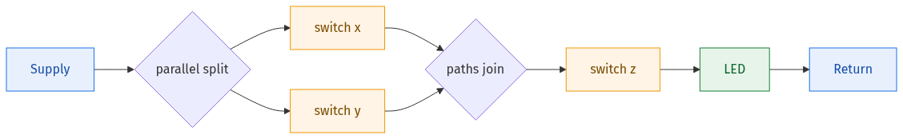
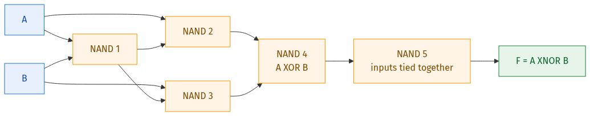
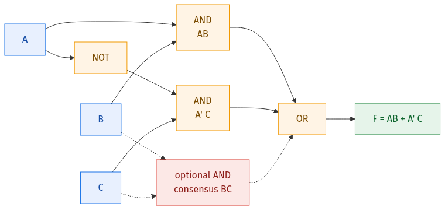
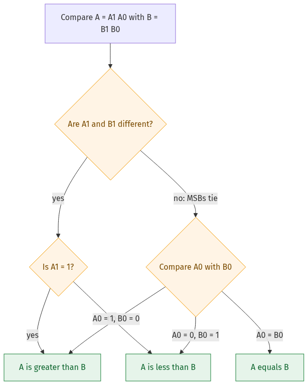
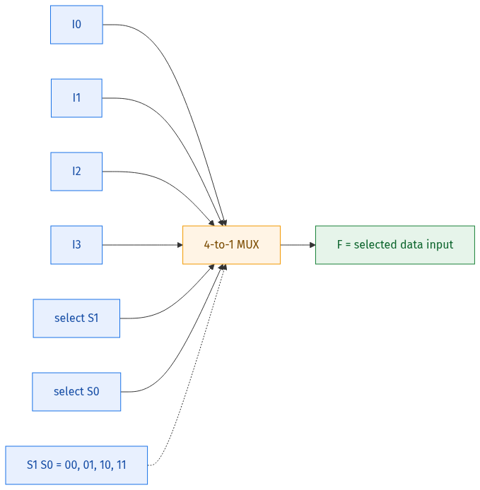
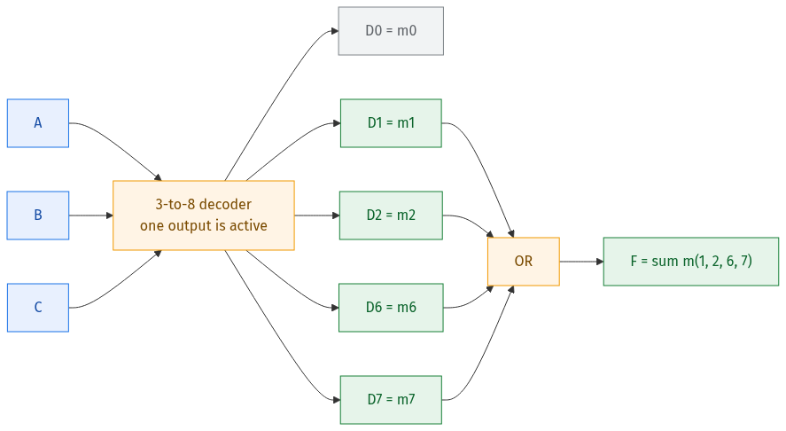
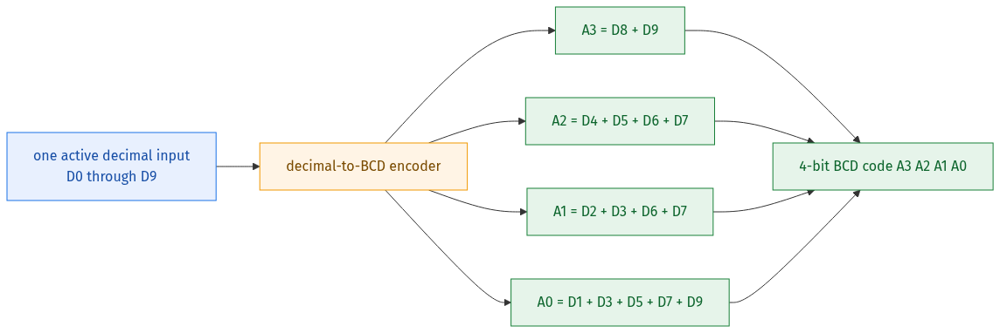
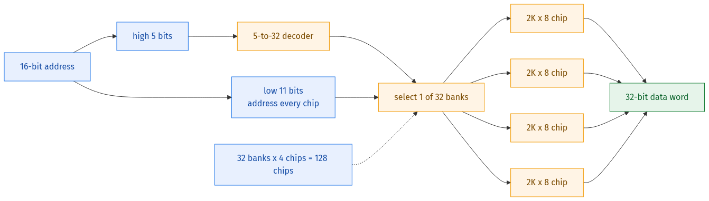

# Weeks 3–4 Learning Guide — Combinational Digital Logic from Zero

This guide teaches the ideas needed for the Week 3 and Week 4 practice and graded assignments. It assumes only that you know the basic gates and the meaning of SOP, POS, minterms, and maxterms. If those are still new, read the [Week 1–2 learning notes](week1-week2-learning-notes.md) first.

Use the companion [Weeks 3–4 quick notes](week3-week4-quick-notes.md) after the ideas in this guide make sense.

> **Diagrams:** The circuit and system diagrams in this guide were rendered as PNG files with Kroki so they display reliably on GitHub. Their editable Mermaid sources are in the [`diagrams`](diagrams/) directory.

**Notation:** A prime means NOT. For example, $A'$ means “NOT $A$.” Juxtaposition means AND, so $AB'$ means “$A$ AND NOT $B$.” A plus sign means OR.

## Start here — the big picture

Weeks 3 and 4 answer two different questions:

| Week | Main question | Topics |
|---|---|---|
| 3 | How do we analyze and implement a Boolean function? | Canonical forms, NAND/NOR-only circuits, parity, probability, switching circuits, delay, hazards, and faults |
| 4 | How do standard combinational blocks solve larger problems? | Comparators, multiplexers, decoders, encoders, priority encoders, and memory expansion |

The most useful overall workflow is:

$$
\text{words or diagram}
\longrightarrow \text{Boolean function}
\longrightarrow \text{simplified function}
\longrightarrow \text{implementation}
\longrightarrow \text{verification}.
$$

Do not start counting gates until the function has been simplified.

## How to study this guide

1. Learn Sections 1–7 for Week 3.
2. Learn Sections 8–13 for Week 4.
3. Use Section 14 whenever a question gives an unfamiliar circuit.
4. Attempt the self-check in Section 18 without looking at the answers.
5. Use the [quick notes](week3-week4-quick-notes.md) for final revision.

---

## Week 3 — Analyzing and implementing logic

### 1. Canonical forms without confusion

#### 1.1 Row numbers are binary input values

For variables written in the order $A,B,C$, treat $A$ as the most significant bit and $C$ as the least significant bit.

For example:

$$
ABC=101_2=5.
$$

That row is row 5 of the truth table.

#### 1.2 Minterm and maxterm rules

For the row $ABC=101$:

$$
m_5=AB'C
$$

because a minterm must become 1 on that row. A 0-bit is therefore complemented.

The matching maxterm is:

$$
M_5=(A'+B+C')
$$

because a maxterm must become 0 on that row. A 1-bit is therefore complemented.

| Form | Uses which rows? | Rule inside one term |
|---|---|---|
| Canonical SOP, $\sum m$ | rows where $F=1$ | 0 becomes complemented; 1 stays plain |
| Canonical POS, $\prod M$ | rows where $F=0$ | 0 stays plain; 1 becomes complemented |

The memory line is:

$$
\boxed{\text{SOP lists the 1-rows; POS lists the 0-rows.}}
$$

#### 1.3 Convert between shorthand forms

With three variables, the complete index set is

$$
U=\{0,1,2,3,4,5,6,7\}.
$$

If

$$
F=\sum m(1,3,5,6),
$$

then the missing indices are $\{0,2,4,7\}$. Therefore:

$$
F=\prod M(0,2,4,7).
$$

The two expressions describe the same function: one lists where it is 1 and the other lists where it is 0.

#### 1.4 Complement shortcuts

Complementing swaps the output values but does not change the row indices:

$$
F=\sum m(S)quad\Longrightarrow\quad F'=\prod M(S),
$$

$$
F=\prod M(S)quad\Longrightarrow\quad F'=\sum m(S).
$$

Example:

$$
F=\sum m(1,3,5,7)
\quad\Longrightarrow\quad
F'=\prod M(1,3,5,7).
$$

This shortcut is especially useful when a question asks for the **maxterms of the complement**.

#### 1.5 Count minterms or maxterms without expanding everything

An $n$-variable function has $2^n$ truth-table rows. Every row is either a minterm row or a maxterm row, so:

$$
\boxed{\\#\text{minterms}+\\#\text{maxterms}=2^n.}
$$

If a four-variable function is 1 on only 2 rows, it has

$$
16-2=14
$$

maxterms.

### 2. Recognizing useful input patterns

#### 2.1 XOR means “different” or odd parity

For two inputs:

$$
A\oplus B=A'B+AB'.
$$

The output is 1 when the inputs differ.

For several inputs, XOR is 1 when an **odd number of inputs are 1**:

$$
A\oplus B\oplus C=(A\oplus B)\oplus C.
$$

A three-input XOR therefore needs two two-input XOR gates.

#### 2.2 XNOR means “equal” or even parity

For two inputs:

$$
A\odot B=AB+A'B'=(A\oplus B)'.
$$

The output is 1 when both inputs match.

#### 2.3 Odd/even comparison uses only the least significant bit

For a binary number $X=X_1X_0$:

- $X$ is even when $X_0=0$;
- $X$ is odd when $X_0=1$.

Therefore two binary numbers $X=X_1X_0$ and $Y=Y_1Y_0$ have the same parity exactly when their least significant bits match:

$$
F=X_0\odot Y_0=X_0Y_0+X_0'Y_0'.
$$

The most significant bits $X_1$ and $Y_1$ do not affect odd/even status.

#### 2.4 Majority and threshold functions

For three inputs, “at least two inputs are 1” is the majority function:

$$
F=AB+AC+BC.
$$

Its dual statement, “at least two inputs are 0,” is:

$$
G=A'B'+A'C'+B'C'.
$$

For $G$, the output is 0 on rows $3,5,6,7$, so:

$$
G=\prod M(3,5,6,7).
$$

When a problem is written in words such as “more than half,” first list which input rows satisfy the sentence. The Boolean form then follows mechanically.

### 3. Variable independence and logic probability

#### 3.1 What “independent of a variable” means

A function is independent of $X$ if changing $X$ can never change the output.

There are two reliable tests:

1. Simplify the function. If $X$ disappears, the function is independent of $X$.
2. Compare the two cofactors. If

   $$
   F\big|_{X=0}=F\big|_{X=1},
   $$

   then $F$ is independent of $X$.

Example:

$$
F(A,B,C)=\sum m(1,3,5,7).
$$

Every listed index is odd, so the least significant bit $C$ is 1 on every 1-row. Thus:

$$
F=C.
$$

The function is independent of $A$ and $B$.

#### 3.2 Probability under uniformly random inputs

If $n$ inputs are independent and every input combination is equally likely, then:

$$
\Pr(F=1)=\frac{\text{number of rows where }F=1}{2^n},
$$

$$
\Pr(F=0)=\frac{\text{number of rows where }F=0}{2^n}.
$$

Example: if $F=C$ and $A,B,C$ are uniformly random, four of the eight rows have $C=1$. Therefore:

$$
\Pr(F=1)=\frac48=\frac12.
$$

#### 3.3 Simplify before counting

Suppose

$$
F=Y(X+W'+Z').
$$

To find $\Pr(F=0)$ for four independent uniform inputs:

- $Y=0$ makes $F=0$ for 8 rows;
- when $Y=1$, the bracket is 0 only for $X=0,W=1,Z=1$, which adds 1 row.

Hence:

$$
\Pr(F=0)=\frac{8+1}{16}=\frac9{16}.
$$

Do not round a probability merely to match a nearby option. Verify the circuit equation and count the exact rows.

### 4. Reading circuit and switching diagrams

#### 4.1 Name every intermediate node

For an unfamiliar gate diagram:

1. Start at the inputs and move toward the output.
2. Give every gate output a temporary name such as $N_1,N_2,N_3$.
3. Write one equation per gate.
4. Substitute only after every local equation is correct.
5. Simplify the final expression.
6. Check one or two input rows.

For example, if

$$
N_1=A',\qquad N_2=N_1B,\qquad F=N_2+C,
$$

then

$$
F=A'B+C.
$$

This node-by-node method prevents a missed bubble from corrupting the entire solution.

#### 4.2 Bubbles always mean inversion

- a bubble on a gate output complements the whole gate result;
- an AND gate with an output bubble is NAND;
- an OR gate with an output bubble is NOR;
- a bubble on an input means that input is complemented before entering the gate.

#### 4.3 Switching circuits

When a closed switch represents 1:

| Physical connection | Boolean operation |
|---|---|
| switches in series | AND |
| switches in parallel | OR |

The following network has switches $x$ and $y$ in parallel, followed by $z$ in series:

The LED glows when

$$
F=(x+y)z=xz+yz.
$$

The factored and expanded expressions describe the same physical network.

### 5. Building with only NAND or only NOR gates

NAND and NOR are called **universal gates** because either type can create NOT, AND, and OR, and therefore any Boolean function.

#### 5.1 NAND constructions

$$
X'=\text{NAND}(X,X)
$$

$$
XY=\text{NAND}(N,N),
\qquad N=\text{NAND}(X,Y)
$$

$$
X+Y=\text{NAND}(X',Y').
$$

For an SOP expression, a NAND–NAND implementation is usually natural. For example:

$$
F=PQ+RS
$$

can be written using De Morgan's law as

$$
F=((PQ)'(RS)')'.
$$

The first NAND layer produces $(PQ)'$ and $(RS)'$; the final NAND performs the OR.

#### 5.2 NOR constructions

$$
X'=\text{NOR}(X,X)
$$

$$
X+Y=\text{NOR}(N,N),
\qquad N=\text{NOR}(X,Y)
$$

$$
XY=\text{NOR}(X',Y').
$$

For a POS expression, a NOR–NOR implementation is usually natural. For example:

$$
F=(P+Q)(R+S)
$$

becomes

$$
F=((P+Q)'+(R+S)')'.
$$

#### 5.3 NAND-only XNOR example

A two-input XOR uses four two-input NAND gates. Inverting its output with one more tied-input NAND creates XNOR:

Thus this direct construction uses five two-input NAND gates.

#### 5.4 Gate-count checklist

Before giving a minimum count, check every assumption:

- Are only two-input gates allowed?
- Are complemented inputs already available?
- May a gate output be reused?
- Are constants 0 and 1 available?
- Is the required output active-high or active-low?
- Does “NAND gate fails” mean only a separate NOT gate fails, or that every inversion bubble fails?

Then:

1. simplify the Boolean function;
2. choose the natural two-level form—SOP for NAND, POS for NOR;
3. share repeated intermediate terms;
4. count tied-input inverters too;
5. verify the final polarity.

### 6. Propagation delay, timing diagrams, and hazards

#### 6.1 Real gates do not change instantly

A gate's **propagation delay** is the time between an input change and the resulting output change.

Along one path, add the delays:

$$
t_{\text{path}}=t_1+t_2+\cdots+t_k.
$$

The worst-case settling time is determined by the longest relevant input-to-output path, often called the **critical path**.

#### 6.2 What creates a glitch

A signal may split into two paths and later reconverge. If one path contains more delay than the other, the final gate can briefly see the wrong combination of old and new values. That short wrong output is a **glitch** or **hazard**.

Consider:

$$
F=AB+A'C.
$$

When $B=C=1$, the correct output is 1 for both $A=0$ and $A=1$. However, one path uses $A$ directly and the other uses $A'$ through an inverter. During a change in $A$, both product terms can briefly become 0.

The redundant consensus term $BC$ covers the transition:

$$
F_{\text{safe}}=AB+A'C+BC.
$$

The Boolean function is unchanged, but the physical circuit becomes resistant to this static-1 hazard.

#### 6.3 Estimating glitch width

In the simple delay model used in introductory problems:

$$
\text{glitch width}\approx
\left|t_{\text{arrival, path 1}}-t_{\text{arrival, path 2}}\right|.
$$

Use only the two sensitized paths caused by the stated input transition. Do not automatically subtract the globally shortest path from the globally longest path.

In real circuits, the final gate's own delay and its inertial behavior can shorten or suppress a very narrow pulse. Use the delay model explicitly stated by the problem.

#### 6.4 Reading a timing diagram

1. Draw vertical boundaries at every time an input changes.
2. Within each interval, read the stable input values.
3. Evaluate the candidate Boolean function.
4. Shift output changes by the relevant propagation delay if delays are included.
5. Compare every interval, not only one convenient point.

For XOR, the output is 1 whenever the number of high inputs is odd. This makes XOR timing patterns easy to recognize.

### 7. Fault analysis

#### 7.1 Common fault models

| Fault | Meaning |
|---|---|
| stuck-at-0 | the signal is always 0 |
| stuck-at-1 | the signal is always 1 |
| inverter becomes a buffer | output equals input instead of its complement |
| open/disconnected line | effect depends on the circuit technology or stated assumption |

#### 7.2 A dependable fault routine

1. Write the correct value of the affected signal for every relevant input.
2. Replace it by the faulty value.
3. Compare correct and faulty outputs.
4. Count only the input cases for which the final observable output changes.

A fault is **not observable** when the correct value already equals the stuck value, or when later logic masks the error.

#### 7.3 Example: one BCD output stuck high

In a decimal-to-BCD encoder,

$$
A_2=D_4+D_5+D_6+D_7.
$$

Normally $A_2=0$ for decimal inputs $0,1,2,3,8,9$. If $A_2$ is stuck at 1, those six output codes are affected. Inputs $4,5,6,7$ are not affected because $A_2$ was already supposed to be 1.

---

## Week 4 — Standard combinational building blocks

### 8. Know what each block does

| Block | Purpose | Direction of information |
|---|---|---|
| comparator | reports $A>B$, $A=B$, or $A<B$ | two values to status outputs |
| multiplexer (MUX) | selects one data input | many data inputs to one output |
| decoder | activates one output for a binary input code | $n$ input bits to up to $2^n$ outputs |
| encoder | produces the binary code of an active input | up to $2^n$ inputs to $n$ code bits |
| priority encoder | encodes the highest-priority active input | many possibly active inputs to one code |

All are combinational: their outputs depend only on their current inputs, not on stored history.

### 9. Magnitude comparators

#### 9.1 One-bit comparator

For one-bit inputs $A$ and $B$:

$$
A>B=AB',
$$

$$
A<B=A'B,
$$

$$
A=B=AB+A'B'=A\odot B.
$$

#### 9.2 Compare multi-bit numbers from the most significant bit

For $A=A_1A_0$ and $B=B_1B_0$, the most significant bits decide unless they are equal.

This gives the easy-to-understand priority forms:

$$
A>B=A_1B_1'+(A_1\odot B_1)A_0B_0',
$$

$$
A<B=A_1'B_1+(A_1\odot B_1)A_0'B_0,
$$

$$
A=B=(A_1\odot B_1)(A_0\odot B_0).
$$

These forms say exactly what a human does: compare the MSBs first; use the LSBs only if the MSBs tie.

#### 9.3 Count how often $A<B$

If each unsigned $n$-bit value ranges from $0$ to $N-1$, where $N=2^n$, then:

- there are $N^2$ ordered pairs $(A,B)$;
- $N$ pairs have $A=B$;
- the remaining pairs split equally between $A<B$ and $A>B$.

Therefore:

$$
\boxed{\\#(A<B)=\\#(A>B)=\frac{N(N-1)}2.}
$$

For two-bit inputs, $N=4$:

$$
\\#(A<B)=\frac{4\cdot3}{2}=6.
$$

### 10. Multiplexers

#### 10.1 A MUX is a controlled selector

A 2-to-1 MUX has two data inputs, one select input, and one output:

$$
\boxed{F=S'I_0+SI_1.}
$$

- if $S=0$, the output is $I_0$;
- if $S=1$, the output is $I_1$.

The select line chooses a data input; it is not normally combined with the data as an arithmetic value.

#### 10.2 Four-to-one MUX

A 4-to-1 MUX needs two select bits:

| $S_1S_0$ | Selected input |
|:---:|:---:|
| 00 | $I_0$ |
| 01 | $I_1$ |
| 10 | $I_2$ |
| 11 | $I_3$ |

Its equation is:

$$
F=S_1'S_0'I_0+S_1'S_0I_1+S_1S_0'I_2+S_1S_0I_3.
$$

Always inspect the input labels in the given diagram. Some drawings place $I_0$ at the top and others at the bottom; the label, not the physical height, determines the selected input.

#### 10.3 Implement a Boolean function with a MUX

To implement a three-variable function $F(A,B,C)$ using one 4-to-1 MUX:

1. choose $A,B$ as the select inputs;
2. group the truth table by $AB=00,01,10,11$;
3. for each pair, inspect the two rows $C=0$ and $C=1$;
4. connect the corresponding data input to $0$, $1$, $C$, or $C'$.

Use this pair-to-input table:

| $F(C=0)$ | $F(C=1)$ | Connect data input to |
|:---:|:---:|:---:|
| 0 | 0 | 0 |
| 0 | 1 | $C$ |
| 1 | 0 | $C'$ |
| 1 | 1 | 1 |

Example:

$$
F(A,B,C)=\sum m(1,2,6,7).
$$

Grouping by $AB$ gives:

| $AB$ | outputs for $C=0,1$ | MUX input |
|:---:|:---:|:---:|
| 00 | 0, 1 | $I_0=C$ |
| 01 | 1, 0 | $I_1=C'$ |
| 10 | 0, 0 | $I_2=0$ |
| 11 | 1, 1 | $I_3=1$ |

So one 4-to-1 MUX implements the function if $C'$ and the constants are available.

This is Shannon expansion in practical form:

$$
F=A'B'F(0,0,C)+A'BF(0,1,C)+AB'F(1,0,C)+ABF(1,1,C).
$$

#### 10.4 MUX trees and minimum counts

A full $N$-to-1 MUX tree made only from 2-to-1 MUXes needs:

$$
\boxed{N-1\text{ two-to-one MUXes}.}
$$

Why? Every 2-to-1 MUX reduces the number of live signal paths by exactly one. Reducing $N$ paths to one requires $N-1$ reductions.

For $N=2^8=256$:

$$
256-1=255.
$$

The tree depth is $\log_2N$, so a 256-to-1 tree has 8 MUX levels.

### 11. Decoders

#### 11.1 A decoder creates one-hot outputs

An $n$-to-$2^n$ active-high decoder asserts exactly one output for each input code.

For a 3-to-8 decoder with inputs $A,B,C$:

$$
D_0=A'B'C',\quad D_1=A'B'C,\quad\ldots,\quad D_7=ABC.
$$

Each decoder output is a minterm:

$$
\boxed{D_i=m_i.}
$$

#### 11.2 Implement functions by collecting decoder outputs

To implement

$$
F=\sum m(1,2,6,7),
$$

OR decoder outputs $D_1,D_2,D_6,D_7$:

If the selected outputs enter a NOR gate instead, then:

$$
F=(D_1+D_3+D_7)'=\prod M(1,3,7).
$$

This is a common exam shortcut:

- decoder + OR of selected lines $\to \sum m(\text{selected indices})$;
- decoder + NOR of selected lines $\to \prod M(\text{selected indices})$.

Check whether the decoder outputs are active-high or active-low before applying the shortcut.

#### 11.3 Cascading 2-to-4 decoders

A 2-to-4 decoder handles two address bits. Enable inputs allow several decoders to be arranged in stages.

For a 7-to-128 decoder, split the 7 address bits as $3+2+2$:

1. make a 3-to-8 first stage using 2 enabled 2-to-4 decoders;
2. use 8 decoders for the next two bits;
3. use 32 decoders for the final two bits.

Under the usual assignment convention that the required complementary enable control is available:

$$
2+8+32=42\text{ decoders}.
$$

Decoder counts depend on enable polarity and whether complemented control signals are available. Read those details before applying a memorized total.

#### 11.4 Addressing a fixed number of outputs

To select one of $m$ outputs, choose the smallest $n$ such that:

$$
2^n\ge m.
$$

For exactly 512 outputs:

$$
512=2^9,
$$

so a 9-to-512 decoder is required. If a question asks for $m-n$:

$$
512-9=503.
$$

### 12. Encoders and priority encoders

#### 12.1 An encoder reverses the decoder idea

A standard $2^n$-to-$n$ encoder assumes exactly one input is active and outputs that input's binary index.

If $D_5=1$, an 8-to-3 encoder outputs:

$$
101_2=5.
$$

A basic encoder does not know what to do if several inputs are high unless the design defines a priority.

#### 12.2 Decimal-to-BCD encoder

BCD represents decimal digits 0 through 9 using four bits:

| Decimal input | $A_3A_2A_1A_0$ |
|:---:|:---:|
| 0 | 0000 |
| 1 | 0001 |
| 2 | 0010 |
| 3 | 0011 |
| 4 | 0100 |
| 5 | 0101 |
| 6 | 0110 |
| 7 | 0111 |
| 8 | 1000 |
| 9 | 1001 |

With one active decimal input $D_i$:

$$
A_0=D_1+D_3+D_5+D_7+D_9,
$$

$$
A_1=D_2+D_3+D_6+D_7,
$$

$$
A_2=D_4+D_5+D_6+D_7,
$$

$$
A_3=D_8+D_9.
$$

If OR gates may have at most five inputs, these four equations need four OR gates—one per output bit.

Notice that $D_0$ appears in no equation because decimal 0 is encoded as `0000`. A real system often adds a **valid** output so “input 0 is active” can be distinguished from “no input is active.”

#### 12.3 Priority encoder

A priority encoder handles multiple simultaneous 1-inputs. It outputs the code of the highest-priority active input and usually provides a valid bit.

For a 4-to-2 priority encoder with $D_3$ highest priority:

- if $D_3=1$, output 3 regardless of $D_2,D_1,D_0$;
- otherwise, if $D_2=1$, output 2;
- otherwise, if $D_1=1$, output 1;
- otherwise, use $D_0$ or report no valid input.

Do not confuse a priority encoder with a comparator. A comparator examines the numerical relationship between two binary numbers; a priority encoder identifies the highest active request line.

### 13. Expanding memory chips

Memory is written as:

$$
\text{number of words}\times\text{bits per word}.
$$

To build a target memory from smaller chips, expand two independent dimensions:

$$
\text{depth factor}=\frac{\text{target words}}{\text{chip words}},
$$

$$
\text{width factor}=\frac{\text{target bits/word}}{\text{chip bits/word}},
$$

$$
\boxed{\text{total chips}=\text{depth factor}\times\text{width factor}.}
$$

#### Worked example: 64K × 32 from 2K × 8 chips

Use $K=2^{10}$.

Depth expansion:

$$
\frac{64K}{2K}=32\text{ banks}.
$$

Width expansion:

$$
\frac{32}{8}=4\text{ chips per bank}.
$$

Total chips:

$$
32\cdot4=128.
$$

Each 2K chip needs

$$
\log_2(2K)=\log_2(2^{11})=11
$$

low-order address bits. The complete 64K memory needs 16 address bits, leaving

$$
16-11=5
$$

high-order bits to select one of 32 banks.

A 5-to-32 bank decoder can be built with 10 enabled 2-to-4 decoders under the assignment's cascade convention: 2 decoders form the first 3-to-8 stage, and 8 more create the final 32 bank-select lines.

Keep these quantities separate:

- chip count comes from depth factor times width factor;
- address bits come from the number of words, not bits per word;
- the decoder selects a bank, while all chips in that bank work in parallel to supply the word width.

### 14. A universal method for unfamiliar circuit questions

Use this routine in order:

#### Step 1 — Identify every symbol

Mark AND, OR, XOR, and all inversion bubbles. For a MUX, locate the select line and the labels $I_0,I_1,\ldots$.

#### Step 2 — Name intermediate nodes

Write $N_1,N_2,N_3$ beside gate outputs. Never try to read a large circuit as one giant expression.

#### Step 3 — Write local equations

For example:

$$
N_1=(AB)',\qquad N_2=A\oplus C,
$$

$$
F=N_1+N_2.
$$

#### Step 4 — Substitute and simplify

Use De Morgan, factoring, complements, and absorption. A complicated diagram may simplify to one variable.

#### Step 5 — Match the requested form

The question may ask for:

- a simplified expression;
- canonical SOP or POS;
- NAND/NOR gate count;
- a probability;
- variables on which the output does not depend;
- a faulty output.

Do not stop at a correct expression if the requested form is different.

#### Step 6 — Verify independently

Use at least one of:

- a complete truth table for up to four variables;
- a few carefully chosen input cases;
- the complement/index-set relationship;
- a small script or simulator.

## 15. Assignment coverage map

| Assignment file | Main concepts | Most relevant sections |
|---|---|---|
| [`pa3.md`](pa3.md) | parity comparison, maxterms of complements, probability, switching, glitches, faults, majority, independence | 1–7 |
| [`ga3.md`](ga3.md) | NAND/NOR implementation, canonical conversion, gate counts, XOR timing, independence | 1, 3, 5, 6, 14 |
| [`pa4.md`](pa4.md) | comparator, BCD encoder, MUX realization, MUX trees, decoder trees | 9–12 |
| [`ga4.md`](ga4.md) | comparator, BCD gates, MUX tracing, decoder logic, RAM expansion, priority encoder | 9–14 |

The assignment files are useful practice, but always verify a saved answer by simplifying the function or checking a truth table. A recorded answer and the underlying mathematics can occasionally disagree.

## 16. Common beginner mistakes

| Mistake | Better habit |
|---|---|
| using 1-rows for POS | POS lists the 0-rows |
| reversing the maxterm bit rule | in a maxterm, 0 is plain and 1 is complemented |
| counting gates before simplifying | simplify first, then map to gates |
| forgetting tied-input NAND/NOR inverters | count each physical inverter gate |
| treating XNOR as XOR | XOR means different; XNOR means equal |
| comparing LSBs before MSBs | a comparator starts at the MSB |
| reading a MUX by input height | use the $I_0,I_1,\ldots$ labels |
| assuming decoder outputs are always active-high | check bubbles and the data sheet/problem statement |
| multiplying memory capacities as one number | calculate depth and width separately |
| subtracting arbitrary path delays for a glitch | analyze the stated input transition and reconvergent paths |
| assuming a fault always changes the final output | check whether later logic masks it |

## 17. Summary — important points to remember

1. SOP uses 1-rows; POS uses 0-rows.
2. $F=\sum m(S)$ implies $F'=\prod M(S)$.
3. XOR detects difference or odd parity; XNOR detects equality.
4. A binary number's least significant bit determines whether it is odd or even.
5. Under uniform inputs, probability is favorable truth-table rows divided by total rows.
6. A function is independent of $X$ when its $X=0$ and $X=1$ cofactors match.
7. Series switches mean AND; parallel switches mean OR.
8. NAND naturally implements SOP; NOR naturally implements POS.
9. Add gate delays along a path; analyze reconvergent path arrival differences for glitches.
10. Multi-bit comparators decide at the first unequal bit, starting from the MSB.
11. A 2-to-1 MUX obeys $F=S'I_0+SI_1$.
12. An $N$-input MUX tree needs $N-1$ two-input MUXes.
13. An active-high decoder output $D_i$ is minterm $m_i$.
14. A normal encoder assumes one active input; a priority encoder handles several.
15. For memory expansion, compute depth factor and width factor separately.

## 18. Self-check practice

Try these before opening the answers.

1. Write the minterm and maxterm for $ABC=110$.
2. If $F=\sum m(0,2,5)$ for three variables, write canonical POS for $F$ and canonical POS for $F'$.
3. Simplify $F(A,B,C)=\sum m(1,3,5,7)$. Which variables is it independent of?
4. Under uniform inputs, what is $\Pr(F=1)$ for the function in Question 3?
5. How many two-input NAND gates does the direct NAND-only XNOR circuit in Section 5.3 use?
6. What redundant term removes the classic static-1 hazard from $AB+A'C$?
7. Write the priority-form expression for $A<B$ when $A=A_1A_0$ and $B=B_1B_0$.
8. A 4-to-1 MUX uses $S_1S_0=10$. Which data input reaches the output?
9. How many 2-to-1 MUXes build a 64-to-1 MUX tree?
10. What function results from OR-ing $D_0,D_3,D_5$ of an active-high 3-to-8 decoder?
11. How many input address bits select one of 512 outputs?
12. How many 2K × 8 chips are required for 16K × 32 memory?

<strong>Answers</strong>

1. $m_6=ABC'$ and $M_6=(A'+B'+C)$.
2. $F=\prod M(1,3,4,6,7)$ and $F'=\prod M(0,2,5)$.
3. $F=C$; it is independent of $A$ and $B$.
4. $1/2$.
5. Five.
6. $BC$.
7. $A_1'B_1+(A_1\odot B_1)A_0'B_0$.
8. $I_2$.
9. $64-1=63$.
10. $F=\sum m(0,3,5)$.
11. $\log_2 512=9$.
12. Depth factor $=16K/2K=8$; width factor $=32/8=4$; total $=8\cdot4=32$ chips.

When these answers feel natural rather than memorized, use the [quick notes](week3-week4-quick-notes.md) for rapid revision and then attempt the four assignment files.
